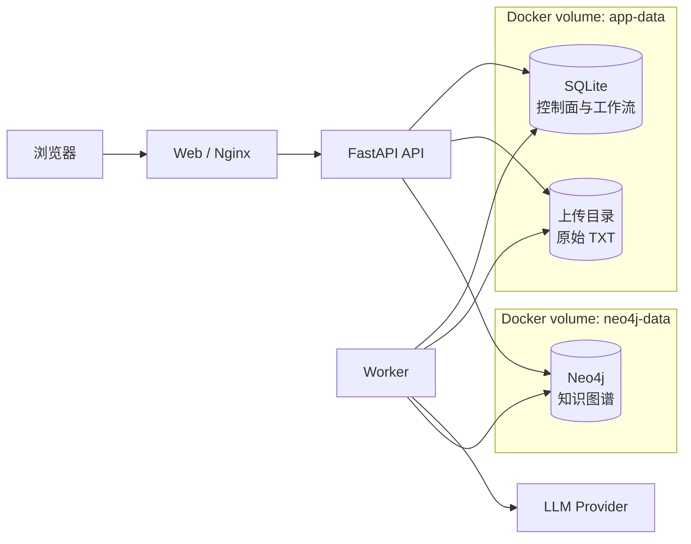
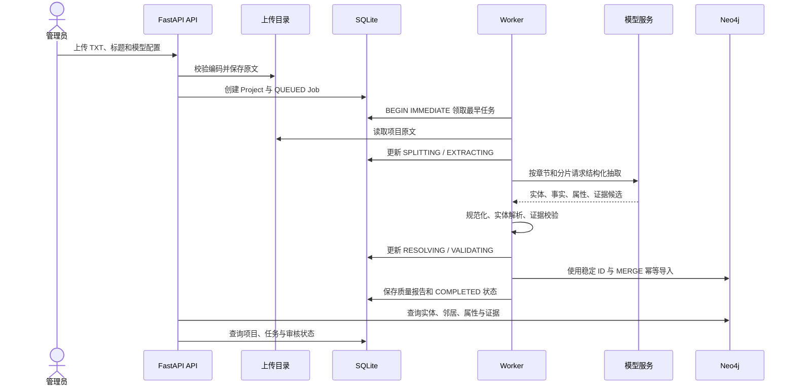
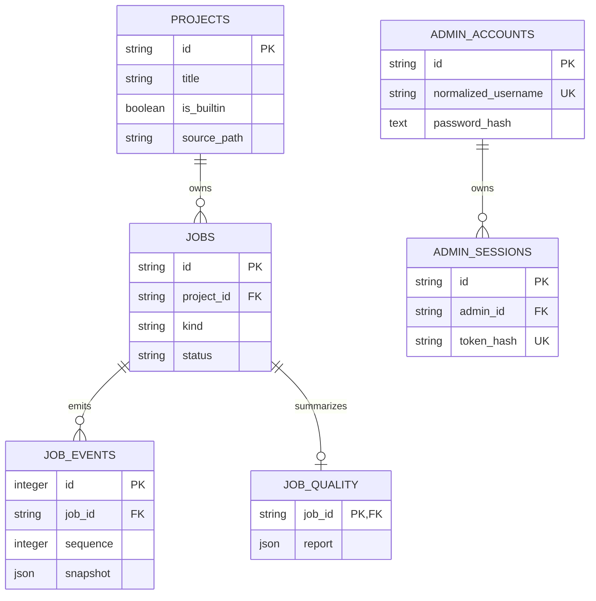
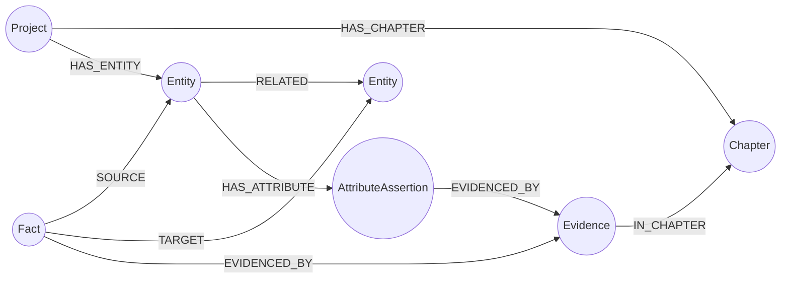

# 江湖图谱数据库设计

版本：1.0

更新日期：2026-07-16
适用版本：当前 `master`（基线提交 `1b7ddc0`）

## 1. 文档目标与适用范围

本文档描述江湖图谱网站当前已经实现的持久化设计，兼顾三类用途：

- **教学演示**：解释本体、知识图谱、事实、属性断言和原文证据如何落到数据库中。
- **开发维护**：提供 SQLite 表结构、Neo4j 属性图结构、约束、索引和数据生命周期。
- **部署运维**：说明 Docker 数据卷、备份恢复、一致性校验、安全边界和常用排查查询。

本文档使用以下标记：

- **当前实现**：可以在当前代码中直接核对的结构或行为。
- **运行时生成**：由 SQLAlchemy `create_all` 或启动兼容升级生成。
- **建议**：尚未实现或需要部署人员执行的改进，不应理解为系统现状。

事实来源按优先级为：

1. [`apps/api/src/app/**/models.py`](../apps/api/src/app/) 中的 SQLAlchemy 模型；
2. [`apps/api/src/app/graph/neo4j.py`](../apps/api/src/app/graph/neo4j.py) 中的 Cypher 写入、约束与索引；
3. 各模块的仓储、服务及审核图操作；
4. [`compose.yaml`](../compose.yaml) 和 [`settings.py`](../apps/api/src/app/settings.py)；
5. 自动测试与既有部署文档。

> 本文档描述的是 Neo4j 属性图实现，而不是 RDF 三元组库。系统中的“本体”负责定义允许的实体类型、关系类型和属性模式；Neo4j 保存这些定义约束下产生的实例数据。

## 2. 总体数据库架构

系统采用 SQLite、Neo4j 和原始文件目录协同工作的混合持久化架构。



### 2.1 存储职责

| 存储 | 当前职责 | 不保存的内容 |
| --- | --- | --- |
| SQLite | 项目元数据、构建任务、任务事件、质量报告、审核队列、管理员账号、会话、限流和审计 | 图遍历结构、实体邻居、关系证据链 |
| Neo4j | 项目图、章节、实体、关系事实、属性断言、原文证据及图查询投影 | 管理员凭据、任务租约、上传文件路径 |
| 上传目录 | 用户上传的原始 TXT，供完整构建和属性补抽重复读取 | 结构化实体、关系和账号数据 |

这种分工的核心原因是：任务状态、认证和审核队列适合关系型事务与唯一约束；人物关系、章节证据和多跳邻居更适合属性图遍历。

### 2.2 默认部署位置

在 Docker Compose 默认配置中：

| 内容 | 容器内位置 | Docker volume |
| --- | --- | --- |
| SQLite 数据库 | `/data/tspw-graph.db` | `app-data` |
| 上传文件根目录 | `/data/uploads` | `app-data` |
| Neo4j 数据目录 | `/data` | `neo4j-data` |

API 和 Worker 共享 `app-data`，因而能看到相同的项目、任务和原始文本。Neo4j 使用独立卷，避免图存储文件与应用文件混放。

## 3. 小说文本进入知识图谱的数据流



关键设计点：

1. 模型输出是**候选数据**，必须经过结构校验、引用校验和证据校验后才能写入 Neo4j。
2. Worker 使用 SQLite 中的 `worker_id` 与 `lease_expires_at` 领取任务；超时租约可以被其他 Worker 接管。
3. Neo4j 使用稳定业务 ID、唯一约束和 `MERGE`，使重试尽量保持幂等。
4. SQLite 与 Neo4j 之间没有分布式事务，系统依靠任务状态、质量报告、幂等导入和人工重试实现最终一致性。

## 4. SQLite 逻辑模型

### 4.1 ER 图

以下实线关系对应 SQLAlchemy 中已声明的外键。



另外七张表使用业务 ID 关联，但当前没有声明数据库外键：

- `review_items.project_id`、`review_actions.project_id`、`quality_snapshots.project_id` 对应 `projects.id`；
- `review_actions.item_id` 对应 `review_items.id`；
- `admin_audit_events.actor_admin_id` 和 `target_admin_id` 对应管理员账号快照语义；
- `admin_login_throttles` 以规范化用户名和来源 IP 为维度，不直接关联账号主键。

### 4.2 初始化与兼容升级

**当前实现：**各仓储初始化时调用 `Base.metadata.create_all(engine)` 创建缺少的表。系统没有引入 Alembic 等正式迁移框架。

为兼容早期数据卷，启动时存在两组手工升级：

- `projects` 缺少 `source_path`、`source_sha256`、`source_encoding` 或 `source_size` 时执行 `ALTER TABLE ... ADD COLUMN`。
- `jobs` 缺少 `kind` 时增加 `VARCHAR(30) NOT NULL DEFAULT 'FULL_BUILD'`。

`create_all` 只创建缺失对象，不会自动修改已有字段类型或约束。因此数据库模型发生进一步变化时，需要新增显式升级逻辑或引入迁移工具。

### 4.3 SQLite 外键执行注意事项

模型声明了三组 `ON DELETE CASCADE`：

- `jobs.project_id -> projects.id`；
- `job_events.job_id -> jobs.id`；
- `job_quality.job_id -> jobs.id`；
- 以及 `admin_sessions.admin_id -> admin_accounts.id`。

但是 SQLite 的外键检查是**连接级开关**。当前运行时代码没有统一执行 `PRAGMA foreign_keys=ON`；自动测试仅在验证级联行为的专门用例中手工开启。因此应区分“DDL 已声明级联”和“所有生产连接都已强制执行级联”。

> **建议：**在统一的 SQLAlchemy Engine 工厂中为每个 SQLite 连接启用 `PRAGMA foreign_keys=ON`，并增加部署升级测试。在完成该改造前，项目删除后的任务残留应纳入一致性检查。

## 5. SQLite 完整表结构

### 5.1 `projects`

用途：保存项目显示信息与原始 TXT 的文件元数据，是任务和图谱项目的控制面根记录。

| 字段 | 类型 | 可空 | 默认/生成 | 约束与说明 |
| --- | --- | --- | --- | --- |
| `id` | `VARCHAR(100)` | 否 | 调用方生成 | 主键；用户项目形如 `project-<uuid>`，内置项目可使用稳定 ID |
| `title` | `VARCHAR(300)` | 否 | 无 | 项目显示名称 |
| `is_builtin` | `BOOLEAN` | 否 | `false` | 内置项目不可通过普通删除接口删除 |
| `source_path` | `VARCHAR(500)` | 是 | `NULL` | 相对上传根目录的源文件路径 |
| `source_sha256` | `VARCHAR(64)` | 是 | `NULL` | 上传内容 SHA-256，用于识别源文件 |
| `source_encoding` | `VARCHAR(30)` | 是 | `NULL` | 已识别编码，如 `utf-8`、`utf-8-bom` 或 `gb18030` |
| `source_size` | `BIGINT` | 是 | `NULL` | 源文件字节数 |
| `created_at` | `DATETIME` | 否 | UTC 当前时间 | 创建时间 |
| `updated_at` | `DATETIME` | 否 | UTC 当前时间 | ORM 更新时刷新 |

主要写入方：项目上传服务、内置项目初始化。主要读取方：页面项目选择器、任务创建、Worker 和项目删除服务。

### 5.2 `jobs`

用途：保存完整构建和属性补抽任务的状态机、Worker 租约、进度与错误码。

| 字段 | 类型 | 可空 | 默认/生成 | 约束与说明 |
| --- | --- | --- | --- | --- |
| `id` | `VARCHAR(100)` | 否 | `job-<uuid>` | 主键 |
| `project_id` | `VARCHAR(100)` | 否 | 无 | 外键到 `projects.id`，声明 `ON DELETE CASCADE`；普通索引 |
| `model_profile_id` | `VARCHAR(100)` | 否 | 无 | 模型配置 ID，不保存 API Key |
| `kind` | `VARCHAR(30)` | 否 | `FULL_BUILD` | `FULL_BUILD` 或 `ATTRIBUTE_BACKFILL` |
| `status` | `VARCHAR(30)` | 否 | `QUEUED` | 任务状态机当前状态 |
| `worker_id` | `VARCHAR(100)` | 是 | `NULL` | 当前租约持有者 |
| `lease_expires_at` | `DATETIME` | 是 | `NULL` | Worker 租约过期时间 |
| `error_code` | `VARCHAR(100)` | 是 | `NULL` | 失败原因的稳定错误码 |
| `completed_chunks` | `INTEGER` | 否 | `0` | 已完成分片数 |
| `total_chunks` | `INTEGER` | 否 | `0` | 总分片数 |
| `created_at` | `DATETIME` | 否 | UTC 当前时间 | 创建时间 |
| `updated_at` | `DATETIME` | 否 | UTC 当前时间 | 每次状态或进度变化时更新 |

任务状态包括：`QUEUED`、`SPLITTING`、`EXTRACTING`、`RESOLVING`、`VALIDATING`、`IMPORTING`、`PAUSED`、`CANCELLED`、`FAILED`、`COMPLETED`。

Worker 领取任务前执行 `BEGIN IMMEDIATE`，按 `created_at` 选择最早的非终态、非暂停且租约可用的任务，降低多个 Worker 同时领取同一任务的风险。

### 5.3 `job_events`

用途：为构建页面的事件流保存任务快照。

| 字段 | 类型 | 可空 | 默认/生成 | 约束与说明 |
| --- | --- | --- | --- | --- |
| `id` | `INTEGER` | 否 | 自增 | 主键 |
| `job_id` | `VARCHAR(100)` | 否 | 无 | 外键到 `jobs.id`，声明 `ON DELETE CASCADE`；普通索引 |
| `sequence` | `INTEGER` | 否 | 当前最大值 + 1 | 单任务内的递增事件序号；当前没有数据库唯一约束 |
| `snapshot` | `JSON` | 否 | 无 | 创建事件时的任务可公开状态快照 |
| `created_at` | `DATETIME` | 否 | UTC 当前时间 | 事件创建时间 |

脱敏载荷示例：

```json
{
  "id": "job-example",
  "project_id": "project-example",
  "model_profile_id": "azure:gpt-4o",
  "kind": "FULL_BUILD",
  "status": "EXTRACTING",
  "completed_chunks": 12,
  "total_chunks": 40,
  "error_code": null
}
```

### 5.4 `job_quality`

用途：保存单个任务的最终质量报告；与任务是一对零或一关系。

| 字段 | 类型 | 可空 | 默认/生成 | 约束与说明 |
| --- | --- | --- | --- | --- |
| `job_id` | `VARCHAR(100)` | 否 | 无 | 主键、外键到 `jobs.id`，声明 `ON DELETE CASCADE` |
| `report` | `JSON` | 否 | 无 | 接受/拒绝实体、事实、属性和证据的汇总及拒绝原因 |

结构示例：

```json
{
  "total_chunks": 40,
  "successful_chunks": 38,
  "failed_chunks": 2,
  "accepted_entities": 37,
  "accepted_facts": 12,
  "accepted_evidence": 15,
  "accepted_attributes": 24,
  "accepted_attribute_evidence": 26,
  "ambiguous_entities": 1,
  "rejected_by_code": {
    "EVIDENCE_MISMATCH": 2,
    "UNKNOWN_RELATION_TYPE": 1
  },
  "model_calls": 40,
  "retry_count": 3
}
```

质量报告允许随抽取管线扩展，因此使用 JSON 而不是固定列。

### 5.5 `review_items`

用途：保存待审核、已解决或已忽略的事实和实体质量问题。

| 字段 | 类型 | 可空 | 默认/生成 | 约束与说明 |
| --- | --- | --- | --- | --- |
| `id` | `VARCHAR(80)` | 否 | `review-<uuid hex>` | 主键 |
| `project_id` | `VARCHAR(100)` | 否 | 无 | 项目业务 ID；普通索引，无外键 |
| `item_type` | `VARCHAR(40)` | 否 | 无 | `FACT`、`DUPLICATE_ENTITY` 或 `ALIAS_SPLIT`；普通索引 |
| `status` | `VARCHAR(20)` | 否 | `OPEN` | `OPEN`、`RESOLVED` 或 `DISMISSED`；普通索引 |
| `source` | `VARCHAR(20)` | 否 | 无 | `rule`、`model` 或 `manual` |
| `reason_code` | `VARCHAR(80)` | 否 | 无 | 进入审核队列的原因；普通索引 |
| `target` | `JSON` | 否 | 无 | 被审核事实、实体对或别名的业务引用 |
| `evidence_ids` | `JSON` | 否 | `[]` | 相关 Neo4j Evidence ID 列表 |
| `fingerprint` | `VARCHAR(300)` | 否 | 无 | 与 `project_id` 组成唯一约束，保证重复扫描幂等 |
| `severity` | `INTEGER` | 否 | `0` | 0–100；列表按严重程度降序展示 |
| `created_at` | `DATETIME` | 否 | UTC 当前时间 | 创建时间 |
| `resolved_at` | `DATETIME` | 是 | `NULL` | 解决或忽略时间 |

`target` 示例：

```json
{"fact_id": "fact-example"}
```

```json
{"source_entity_id": "entity-typo", "target_entity_id": "entity-canonical"}
```

```json
{"source_entity_id": "entity-example", "alias": "别名"}
```

### 5.6 `review_actions`

用途：记录管理员对审核项执行的事实接受、拒绝、实体合并、别名拆分和忽略操作。

| 字段 | 类型 | 可空 | 默认/生成 | 约束与说明 |
| --- | --- | --- | --- | --- |
| `id` | `VARCHAR(80)` | 否 | `action-<uuid hex>` | 主键 |
| `project_id` | `VARCHAR(100)` | 否 | 无 | 项目业务 ID；普通索引，无外键 |
| `item_id` | `VARCHAR(80)` | 否 | 无 | 审核项业务 ID；普通索引，无外键 |
| `action_type` | `VARCHAR(40)` | 否 | 无 | 审核动作类型 |
| `reviewer` | `VARCHAR(120)` | 否 | `local_reviewer` | 操作者标识；认证接入后由服务传入 |
| `payload` | `JSON` | 否 | `{}` | 动作参数，例如合并目标或拆分别名 |
| `idempotency_key` | `VARCHAR(200)` | 否 | 无 | 客户端幂等键 |
| `created_at` | `DATETIME` | 否 | UTC 当前时间 | 动作创建时间 |

唯一约束：`(project_id, item_id, action_type, idempotency_key)`。

载荷示例：

```json
{
  "source_entity_id": "entity-typo",
  "target_entity_id": "entity-canonical"
}
```

### 5.7 `quality_snapshots`

用途：保存项目级审核质量指标的时间点快照。

| 字段 | 类型 | 可空 | 默认/生成 | 约束与说明 |
| --- | --- | --- | --- | --- |
| `id` | `VARCHAR(80)` | 否 | `quality-<uuid hex>` | 主键 |
| `project_id` | `VARCHAR(100)` | 否 | 无 | 项目业务 ID；普通索引，无外键 |
| `metrics` | `JSON` | 否 | 无 | 项目级指标集合 |
| `created_at` | `DATETIME` | 否 | UTC 当前时间 | 快照时间 |

示例：

```json
{
  "open_review_items": 9,
  "evidence_coverage": 0.92,
  "duplicate_candidates": 2
}
```

当前数据模型已经定义该表，但现有服务中未发现活动写入路径；上述内容仅展示 `metrics` JSON 容器可承载的项目级指标，不代表系统已自动生成这些指标。

### 5.8 `admin_accounts`

用途：保存管理员账号和密码摘要。

| 字段 | 类型 | 可空 | 默认/生成 | 约束与说明 |
| --- | --- | --- | --- | --- |
| `id` | `VARCHAR(100)` | 否 | `admin-<uuid>` | 主键 |
| `username` | `VARCHAR(64)` | 否 | 无 | 显示用户名 |
| `normalized_username` | `VARCHAR(64)` | 否 | 无 | 去空白并 `casefold`；唯一索引 |
| `password_hash` | `TEXT` | 否 | 无 | Argon2 密码摘要，不保存明文 |
| `enabled` | `BOOLEAN` | 否 | `true` | 是否允许登录 |
| `must_change_password` | `BOOLEAN` | 否 | `true` | 是否必须先修改临时密码 |
| `created_at` | `DATETIME` | 否 | UTC 当前时间 | 创建时间 |
| `updated_at` | `DATETIME` | 否 | UTC 当前时间 | 账号变更时间 |

首次启动且账号表为空时，服务会幂等创建环境变量指定的缺省管理员，并立即保存密码摘要。

### 5.9 `admin_sessions`

用途：保存服务端不透明会话。

| 字段 | 类型 | 可空 | 默认/生成 | 约束与说明 |
| --- | --- | --- | --- | --- |
| `id` | `VARCHAR(100)` | 否 | `session-<uuid>` | 主键 |
| `admin_id` | `VARCHAR(100)` | 否 | 无 | 外键到 `admin_accounts.id`，声明 `ON DELETE CASCADE`；普通索引 |
| `token_hash` | `VARCHAR(64)` | 否 | SHA-256 | 唯一索引；数据库不保存原始令牌 |
| `csrf_token` | `VARCHAR(200)` | 否 | 安全随机值 | 状态变更请求的 CSRF 比对值 |
| `ip_address` | `VARCHAR(100)` | 是 | `NULL` | 会话来源地址 |
| `user_agent` | `VARCHAR(500)` | 是 | `NULL` | 浏览器标识 |
| `created_at` | `DATETIME` | 否 | UTC 当前时间 | 创建时间 |
| `last_seen_at` | `DATETIME` | 否 | UTC 当前时间 | 最近活动时间 |
| `expires_at` | `DATETIME` | 否 | 服务计算 | 闲置过期时间；普通索引 |

### 5.10 `admin_login_throttles`

用途：按“规范化用户名 + 来源 IP”记录连续登录失败和临时锁定。

| 字段 | 类型 | 可空 | 默认/生成 | 约束与说明 |
| --- | --- | --- | --- | --- |
| `id` | `VARCHAR(100)` | 否 | `throttle-<uuid>` | 主键 |
| `normalized_username` | `VARCHAR(64)` | 否 | 无 | 规范化用户名 |
| `ip_address` | `VARCHAR(100)` | 否 | 无 | 来源地址 |
| `failure_count` | `INTEGER` | 否 | `0` | 连续失败次数 |
| `locked_until` | `DATETIME` | 是 | `NULL` | 临时锁定截止时间 |
| `updated_at` | `DATETIME` | 否 | UTC 当前时间 | 最近更新 |

唯一约束：`(normalized_username, ip_address)`。更新失败计数前使用 `BEGIN IMMEDIATE` 串行化 SQLite 写入。

### 5.11 `admin_audit_events`

用途：记录登录、退出、改密、管理员创建/重命名/启停/重置和系统恢复等安全事件。

| 字段 | 类型 | 可空 | 默认/生成 | 约束与说明 |
| --- | --- | --- | --- | --- |
| `id` | `VARCHAR(100)` | 否 | `audit-<uuid>` | 主键 |
| `actor_admin_id` | `VARCHAR(100)` | 是 | `NULL` | 操作者账号 ID 快照；普通索引，无外键 |
| `actor_username` | `VARCHAR(64)` | 是 | `NULL` | 操作者当时的用户名 |
| `target_admin_id` | `VARCHAR(100)` | 是 | `NULL` | 目标账号 ID 快照；普通索引，无外键 |
| `target_username` | `VARCHAR(64)` | 是 | `NULL` | 目标账号当时的用户名 |
| `action` | `VARCHAR(100)` | 否 | 无 | 动作名称；普通索引 |
| `result` | `VARCHAR(50)` | 否 | 无 | `SUCCESS`、`REJECTED` 或 `LOCKED` 等结果 |
| `ip_address` | `VARCHAR(100)` | 是 | `NULL` | 来源地址 |
| `metadata` | `JSON` | 否 | `{}` | 已过滤敏感键的结构化上下文 |
| `created_at` | `DATETIME` | 否 | UTC 当前时间 | 事件时间；普通索引 |

示例：

```json
{
  "old_username": "old-admin",
  "new_username": "new-admin"
}
```

仓储会过滤 `password`、`password_hash`、`cookie`、`session_token`、`csrf`、`csrf_token` 和 `token` 等元数据键。

## 6. Neo4j 属性图模型

### 6.1 模型总览



图中存在两种关系表达：

- `Fact` 节点是**可审核、可追溯的领域事实**，保存关系类型、端点 ID、章节有效范围、置信度和证据引用。
- `RELATED` 是从同一事实投影出的**邻居遍历关系**，使图谱页面能直接从一个实体展开邻居，而不必每次通过 `Fact` 节点中转。

两者共享同一个事实 `id`。审核接受或拒绝事实时，服务同时更新 `Fact.review_status` 和对应 `RELATED.review_status`。

### 6.2 唯一约束

API/Worker 初始化图写入器时幂等创建以下约束：

| 约束名 | 标签 | 唯一键 | 用途 |
| --- | --- | --- | --- |
| `project_id` | `Project` | `id` | 保证项目根节点唯一 |
| `chapter_id` | `Chapter` | `(project_id, id)` | 章节按项目隔离 |
| `entity_id` | `Entity` | `(project_id, id)` | 实体按项目隔离 |
| `fact_id` | `Fact` | `(project_id, id)` | 事实按项目隔离 |
| `evidence_id` | `Evidence` | `(project_id, id)` | 证据按项目隔离 |
| `attribute_assertion_id` | `AttributeAssertion` | `(project_id, id)` | 属性断言按项目隔离 |

`Project` 节点自身不保存 `project_id`，其 `id` 就是项目 ID。其他业务节点均保存 `project_id`。

### 6.3 索引

| 索引名 | 标签 | 属性 | 主要查询 |
| --- | --- | --- | --- |
| `entity_project_name` | `Entity` | `(project_id, name)` | 项目内按实体名称定位 |
| `entity_project_type` | `Entity` | `(project_id, type)` | 项目内按本体类型过滤 |

精确名称查询最容易利用复合索引。`CONTAINS`、对别名数组的包含判断或不带 `project_id` 的查询可能退化为更多扫描。

## 7. Neo4j 节点、关系和属性字典

### 7.1 节点字典

#### `Project`

| 项目 | 说明 |
| --- | --- |
| 业务键 | `id` |
| 主要属性 | `id`、`title` |
| 出边 | `HAS_CHAPTER`、`HAS_ENTITY` |
| 写入方式 | `MERGE (n:Project {id: row.id}) SET n += row` |
| 删除方式 | 项目删除流程最后按 `Project.id` 执行 `DETACH DELETE` |

#### `Chapter`

| 项目 | 说明 |
| --- | --- |
| 业务键 | `(project_id, id)` |
| 主要属性 | `project_id`、`id`、`number`、`title` |
| 入边 | `Project-[:HAS_CHAPTER]->Chapter`、`Evidence-[:IN_CHAPTER]->Chapter` |
| ID 规则 | 当前构建为 `<project_id>:chapter:<number>` |

#### `Entity`

| 项目 | 说明 |
| --- | --- |
| 业务键 | `(project_id, id)` |
| 主要属性 | `project_id`、`id`、`type`、`name`、`aliases`、`description` |
| 审核属性 | `review_status`、合并/拆分操作产生的状态；读取模型也预留 `merged_into` |
| 入边 | `HAS_ENTITY`、`SOURCE`、`TARGET`、`RELATED`、`HAS_ATTRIBUTE` 的方向依语义而定 |
| 出边 | `RELATED`、`HAS_ATTRIBUTE` |

`type` 对应本体实体类型，例如 `Person`、`Sect`、`Swordplay`、`Event`、`Place`。所有类型实例仍使用统一的 `Entity` 标签，具体类型存放在属性中。

#### `Fact`

| 项目 | 说明 |
| --- | --- |
| 业务键 | `(project_id, id)` |
| 主要属性 | `project_id`、`id`、`type`、`source_id`、`target_id`、`evidence_ids`、`from_chapter`、`to_chapter`、`confidence` |
| 审核属性 | `review_status`，可为 `ACCEPTED` 或 `REJECTED` |
| 出边 | `SOURCE`、`TARGET`、`EVIDENCED_BY` |
| 角色 | 关系事实的权威记录，用于证据与审核 |

`from_chapter` 和 `to_chapter` 表示关系在故事中的有效区间。两者为空时表示当前没有可靠的章节边界，而不是“永远有效”。

#### `Evidence`

| 项目 | 说明 |
| --- | --- |
| 业务键 | `(project_id, id)` |
| 主要属性 | `project_id`、`id`、`chapter_id`、`start_offset`、`end_offset`、`quote`、`text_hash` |
| 入边 | `Fact-[:EVIDENCED_BY]->Evidence`、`AttributeAssertion-[:EVIDENCED_BY]->Evidence` |
| 出边 | `IN_CHAPTER` |
| 校验规则 | `end_offset > start_offset`；`quote` 为 1–500 字符；摘录必须与当前分片原文匹配 |

证据只保存必要摘录和全文偏移，不保存整部小说。`text_hash` 用于标识证据文本；偏移依赖上传原文保持稳定。

#### `AttributeAssertion`

| 项目 | 说明 |
| --- | --- |
| 业务键 | `(project_id, id)` |
| 主要属性 | `project_id`、`id`、`entity_id`、`entity_name`、`entity_type`、`property_id`、`value`、`value_type`、`confidence`、`evidence_ids` |
| 入边 | `Entity-[:HAS_ATTRIBUTE]->AttributeAssertion` |
| 出边 | `EVIDENCED_BY` |
| ID 规则 | `project_id + canonical entity_id + property_id + value` 的 SHA-256 前 16 位 |

属性断言不是直接写在 Entity 上的自由 JSON。独立节点使同一属性值可以拥有置信度、多条证据和稳定 ID，也便于后续审核。

### 7.2 关系字典

| 关系 | 起点 | 终点 | 关系属性 | 角色 |
| --- | --- | --- | --- | --- |
| `HAS_CHAPTER` | `Project` | `Chapter` | 无 | 项目结构 |
| `HAS_ENTITY` | `Project` | `Entity` | 无 | 项目结构 |
| `IN_CHAPTER` | `Evidence` | `Chapter` | 无 | 证据定位 |
| `SOURCE` | `Fact` | `Entity` | 无 | 事实主语引用 |
| `TARGET` | `Fact` | `Entity` | 无 | 事实宾语引用 |
| `RELATED` | `Entity` | `Entity` | `project_id`、`id`、`type`、`from_chapter`、`to_chapter`、`confidence`、可选 `review_status` | 邻域遍历投影 |
| `EVIDENCED_BY` | `Fact` / `AttributeAssertion` | `Evidence` | 无 | 可追溯证据 |
| `HAS_ATTRIBUTE` | `Entity` | `AttributeAssertion` | 无 | 属性归属 |

`RELATED.type` 是本体关系类型，例如 `MEMBER_OF`、`MASTER_OF`、`HOLDS`、`KNOWS`。它不是 Neo4j 动态关系类型；所有领域关系统一使用 `RELATED`，再用 `type` 属性区分。

## 8. SQLite 与 Neo4j 的数据映射

| SQLite | Neo4j | 映射方式 |
| --- | --- | --- |
| `projects.id` | `(:Project).id` | 一对一的项目根标识 |
| `jobs.project_id` | 所有图业务节点的 `project_id` | 决定 Worker 写入哪个项目图 |
| `review_items.target.fact_id` | `(:Fact).id` / `[:RELATED].id` | 审核事实定位 |
| `review_items.target.source_entity_id` | `(:Entity).id` | 合并或拆分源实体 |
| `review_items.evidence_ids[]` | `(:Evidence).id` | 审核界面展示原文证据 |
| `review_actions.payload` | 图审核操作参数 | 记录已执行图变更的输入 |

SQLite 不保存 Entity、Fact、Evidence 的完整副本；Neo4j 也不保存任务租约、管理员会话或文件路径。跨库关联由稳定业务 ID 完成，不存在数据库层面的跨库外键。

## 9. 项目隔离、实体合并与审核一致性

### 9.1 项目隔离

所有图查询都应携带 `$project_id`。仅凭实体名称或实体 ID 查询会产生跨项目串图风险，因为不同小说项目可以出现同名人物和相同局部 ID。

Neo4j 约束用 `(project_id, id)` 隔离业务节点；`RELATED` 同样保存 `project_id`。SQLite 的项目级表使用 `project_id` 过滤，但审核表目前没有到 `projects` 的外键。

### 9.2 事实审核

- 接受事实：将 `Fact.review_status` 和同 ID 的 `RELATED.review_status` 设置为 `ACCEPTED`。
- 拒绝事实：将两者设置为 `REJECTED`。
- 审核动作先修改 Neo4j，再在 SQLite 记录 `review_actions` 并解决 `review_items`。

这不是跨库原子事务。如果 Neo4j 已更新而 SQLite 写动作失败，可能出现图状态已改变但审核项仍开放的短暂不一致；幂等键用于降低重复提交影响。

### 9.3 实体合并

当前合并流程：

1. 把源实体名称和别名并入目标实体并去重。
2. 把以源实体为端点的入向、出向 `RELATED` 迁移到目标实体。
3. 更新相关 `Fact.source_id` / `target_id` 和 `SOURCE` / `TARGET` 边。
4. 删除源实体。

**当前限制：**合并 Cypher 没有迁移源实体的 `HAS_ATTRIBUTE`。源实体 `DETACH DELETE` 后，相关 `AttributeAssertion` 可能失去实体归属但仍作为项目节点存在。合并前应在审核界面核对属性；后续应在同一 Cypher 事务中迁移、去重属性断言并清理孤立节点。

### 9.4 别名拆分

别名拆分从源实体 `aliases` 中移除指定别名，并创建或复用一个新 `Entity`。当前实现不会自动把事实、属性或证据迁移到新实体，也没有显式补建 `Project-[:HAS_ENTITY]->新实体`；这些属于后续完善点。

## 10. 索引、约束与性能设计

### 10.1 SQLite

当前索引集中在：

- 外键或业务过滤字段：`jobs.project_id`、`job_events.job_id`、`review_items.project_id`、`review_actions.project_id` 等；
- 审核队列排序与过滤：`item_type`、`status`、`reason_code`；
- 管理员认证：规范化用户名、会话令牌摘要、会话过期时间；
- 安全审计：操作者、目标、动作和创建时间。

SQLite 适合当前单机 Docker 部署和低并发管理写入。任务领取和登录限流使用 `BEGIN IMMEDIATE`，主动获取写锁，避免“先读后写”的竞争窗口。

### 10.2 Neo4j

邻域查询的典型路径是：

1. 通过 `(project_id, name)` 定位中心实体；
2. 沿中心实体的 `RELATED` 展开一度邻居；
3. 用户主动选择后再读取详情、事实和证据；
4. 二度关系按需展开，避免进入页面即加载全图。

`Fact` 和 Evidence 查询通常先通过实体或事实 ID 缩小范围，再沿结构关系访问证据。当前没有为 `RELATED.id` 单独建立关系索引；审核更新使用带 `project_id` 和 `id` 的关系匹配。

### 10.3 建议监控指标

- SQLite 文件大小、写锁等待和处于非终态的任务数；
- 过期但仍被 `worker_id` 占用的任务数；
- 单项目 Entity、Fact、Evidence 和 AttributeAssertion 数量；
- 没有 `HAS_ENTITY` 的 Entity、没有 `HAS_ATTRIBUTE` 入边的 AttributeAssertion；
- `Fact` 与同 ID `RELATED` 的数量差异；
- 实体名称查询和邻域查询的 P95 延迟。

## 11. 数据生命周期与删除

### 11.1 完整构建

完整构建会：

- 在 SQLite 创建 `FULL_BUILD` 任务及事件；
- 从上传目录读取 UTF-8 规范化后的 `source.txt`；
- 向 Neo4j `MERGE` 项目、章节、实体、证据、属性和事实；
- 保存任务质量报告并进入 `COMPLETED`。

**当前限制：**导入器是 upsert，不会在同一个项目重新完整构建前清空旧图。新结果中已消失的旧实体或事实可能继续保留。当前 UI 的常规上传会创建新项目 ID，因此不会覆盖已有项目；若未来增加“原项目重建”，应先设计版本切换或安全清理策略。

### 11.2 属性补抽

`ATTRIBUTE_BACKFILL` 只解析到现有实体并增量写入 AttributeAssertion 和属性 Evidence，不重写现有实体和 Fact。稳定断言 ID 使同一“实体 + 属性 + 值”复用节点并合并证据。

### 11.3 任务暂停、失败与重试

- `PAUSED` 任务不被 Worker 领取；恢复后回到 `QUEUED`。
- `FAILED` 保存稳定 `error_code`，可以重新排队或取消。
- Worker 异常时清除租约并写入任务事件。
- 模型 429 等可重试错误由抽取层执行有限次数退避；最终失败仍由任务状态暴露。

### 11.4 项目删除

普通用户项目的删除顺序为：

1. 删除 Neo4j 中所有 `project_id` 匹配的节点及其关系；
2. 删除 `(:Project {id: project_id})`；
3. 删除上传目录中的项目文件夹；
4. 删除 SQLite `projects` 记录。

内置项目禁止通过该服务删除。以上步骤跨 Neo4j、文件系统和 SQLite，不能组成单一事务；任一步骤失败都可能留下部分数据。并且由于 SQLite 运行连接未统一启用外键，任务级联清理需要额外核对。

> **建议：**把项目删除改为可恢复的后台任务，记录每一步结果；为审核表显式增加项目外键或集中清理逻辑，并统一启用 SQLite 外键。

## 12. Docker 数据卷、备份与恢复

### 12.1 备份范围

完整备份至少包含：

1. `tspw-graph_app-data`：SQLite 数据库和上传原文；
2. `tspw-graph_neo4j-data`：Neo4j 数据目录；
3. `.env` 或等价部署配置：应存入受控的密钥管理位置，不与普通备份日志混放；
4. 当前 Git 提交、Compose 文件版本和备份时间。

SQLite 和 Neo4j 没有共同快照协议。最可靠的方法是在同一个维护窗口停止写入后备份两个卷。

### 12.2 一致性备份示例

以下示例假设 Compose 项目名为 `tspw-graph`。执行前应通过 `docker volume ls` 核对实际卷名。

```bash
# 1. 停止对数据库有写入的服务
docker compose stop web api worker
docker compose stop neo4j

# 2. 建立备份目录
mkdir -p "backups/2026-07-16"

# 3. 备份 SQLite 与上传文件
docker run --rm \
  -v tspw-graph_app-data:/source:ro \
  -v "$PWD/backups/2026-07-16:/backup" \
  alpine sh -c 'tar czf /backup/app-data.tgz -C /source .'

# 4. 备份 Neo4j 数据目录
docker run --rm \
  -v tspw-graph_neo4j-data:/source:ro \
  -v "$PWD/backups/2026-07-16:/backup" \
  alpine sh -c 'tar czf /backup/neo4j-data.tgz -C /source .'

# 5. 恢复服务并等待健康检查
docker compose up -d --wait --wait-timeout 120
```

Neo4j Community 版不提供 Enterprise 在线备份能力。直接复制运行中的数据库目录可能得到不一致快照，因此示例先停止 Neo4j。

### 12.3 恢复原则

> **危险操作：**恢复会覆盖当前数据。必须先备份现状并确认目标备份日期、卷名和 Compose 项目名。不要在没有回滚副本时删除或清空数据卷。

恢复步骤：

1. 停止整个 Compose 应用。
2. 将 `app-data.tgz` 恢复到空的应用数据卷。
3. 将 `neo4j-data.tgz` 恢复到空的 Neo4j 数据卷。
4. 恢复与备份匹配的 `.env`、Compose 文件和应用版本。
5. 先启动 Neo4j，再启动 API、Worker 与 Web。
6. 执行第 12.4 节的一致性校验。

建议先在隔离环境恢复演练，确认能登录、列出项目、查询实体和读取证据后再替换生产数据。

### 12.4 恢复后一致性校验

```bash
docker compose ps
curl -fsS http://localhost:5173/api/health
```

SQLite 项目与任务检查：

```bash
docker compose exec -T api python - <<'PY'
import os
import sqlite3

path = os.environ["SQLITE_URL"].removeprefix("sqlite:///")
connection = sqlite3.connect(path)
print("projects", connection.execute("SELECT count(*) FROM projects").fetchone()[0])
print("jobs", connection.execute("SELECT status, count(*) FROM jobs GROUP BY status").fetchall())
PY
```

Neo4j 项目计数检查：

```cypher
MATCH (p:Project)
OPTIONAL MATCH (e:Entity {project_id: p.id})
WITH p, count(e) AS entities
OPTIONAL MATCH (f:Fact {project_id: p.id})
RETURN p.id AS project_id, p.title AS title, entities, count(f) AS facts
ORDER BY title;
```

如果备份时存在 `SPLITTING` 到 `IMPORTING` 的非终态任务，不应直接假设其图写入完整。应结合任务事件、质量报告和 Neo4j 数量判断是重新排队、取消还是创建新构建。

## 13. 安全设计

### 13.1 管理员凭据

- 密码使用 `argon2.PasswordHasher` 生成 Argon2 摘要，SQLite 不保存明文。
- 缺省管理员只在账号表为空时初始化；生产部署应覆盖初始密码并在首次登录后修改。
- 管理员不能停用最后一个有效管理员；停用或重置密码会撤销目标账号会话。

### 13.2 会话与 CSRF

- 浏览器持有高熵随机会话令牌；数据库只保存 SHA-256 摘要。
- 原始会话令牌通过 HttpOnly Cookie 传输，不写入 localStorage。
- 状态变更请求还需要与会话记录匹配的 CSRF 值，并使用恒定时间比较。
- 会话按 `last_seen_at` 与 `expires_at` 实现闲置过期。

### 13.3 审计与敏感字段

- 审计保留操作者和目标用户名快照，避免账号重命名后失去上下文。
- 审计元数据过滤密码、摘要、Cookie、会话令牌和 CSRF 等键。
- 运维查询不得输出 `password_hash`、`token_hash` 或 `csrf_token`。
- Azure OpenAI Key 只通过环境变量传入，不进入 SQLite 或 Neo4j。

### 13.4 网络暴露

Compose 当前把 Neo4j HTTP `7474` 和 Bolt `7687` 映射到宿主机所有接口。开发环境便于调试，但生产环境应：

- 通过防火墙或私有网络限制端口来源；
- 如无浏览器管理需求，取消 `7474` 的公网映射；
- 使用强 Neo4j 密码并避免默认值；
- 对外 Web 入口启用 HTTPS，并设置 `AUTH_COOKIE_SECURE=true`；
- 不在日志或排查截图中展示 Key、Cookie 和完整连接串密码。

## 14. 典型 SQL、典型 Cypher 和排查查询

### 14.1 SQLite：项目及最新任务

```sql
SELECT
    p.id,
    p.title,
    p.source_encoding,
    p.source_size,
    j.id AS latest_job_id,
    j.kind,
    j.status,
    j.error_code,
    j.updated_at
FROM projects AS p
LEFT JOIN jobs AS j
  ON j.id = (
      SELECT j2.id
      FROM jobs AS j2
      WHERE j2.project_id = p.id
      ORDER BY j2.created_at DESC
      LIMIT 1
  )
ORDER BY p.created_at DESC;
```

### 14.2 SQLite：排队与被租用任务

```sql
SELECT
    id,
    project_id,
    kind,
    status,
    worker_id,
    lease_expires_at,
    completed_chunks,
    total_chunks,
    updated_at
FROM jobs
WHERE status NOT IN ('COMPLETED', 'FAILED', 'CANCELLED')
ORDER BY created_at;
```

### 14.3 SQLite：任务质量报告

```sql
SELECT j.id, j.project_id, j.status, q.report
FROM jobs AS j
LEFT JOIN job_quality AS q ON q.job_id = j.id
WHERE j.project_id = :project_id
ORDER BY j.created_at DESC;
```

### 14.4 SQLite：待审核项统计

```sql
SELECT item_type, reason_code, count(*) AS item_count
FROM review_items
WHERE project_id = :project_id
  AND status = 'OPEN'
GROUP BY item_type, reason_code
ORDER BY item_count DESC, reason_code;
```

### 14.5 SQLite：有效会话和最近审计事件

```sql
SELECT a.username, count(s.id) AS active_sessions
FROM admin_accounts AS a
LEFT JOIN admin_sessions AS s
  ON s.admin_id = a.id
 AND s.expires_at > CURRENT_TIMESTAMP
GROUP BY a.id, a.username
ORDER BY a.normalized_username;
```

```sql
SELECT created_at, actor_username, target_username, action, result, ip_address
FROM admin_audit_events
ORDER BY created_at DESC
LIMIT 100;
```

### 14.6 Cypher：按名称搜索项目内实体

精确名称可直接利用复合索引：

```cypher
MATCH (entity:Entity {project_id: $project_id, name: $name})
WHERE coalesce(entity.review_status, 'ACCEPTED') <> 'MERGED'
RETURN entity.id, entity.type, entity.name, entity.aliases, entity.description;
```

同时搜索别名：

```cypher
MATCH (entity:Entity {project_id: $project_id})
WHERE entity.name = $name OR $name IN coalesce(entity.aliases, [])
RETURN entity
LIMIT 20;
```

### 14.7 Cypher：实体一度关系

```cypher
MATCH (center:Entity {project_id: $project_id, id: $entity_id})
MATCH (center)-[relation:RELATED]-(neighbor:Entity {project_id: $project_id})
WHERE coalesce(relation.review_status, 'ACCEPTED') <> 'REJECTED'
RETURN
    center,
    relation.id AS fact_id,
    relation.type AS relation_type,
    relation.from_chapter AS from_chapter,
    relation.to_chapter AS to_chapter,
    neighbor
ORDER BY relation_type, neighbor.name;
```

### 14.8 Cypher：关系事实及原文证据

```cypher
MATCH (fact:Fact {project_id: $project_id, id: $fact_id})
MATCH (fact)-[:SOURCE]->(source:Entity)
MATCH (fact)-[:TARGET]->(target:Entity)
OPTIONAL MATCH (fact)-[:EVIDENCED_BY]->(evidence:Evidence)
OPTIONAL MATCH (evidence)-[:IN_CHAPTER]->(chapter:Chapter)
RETURN
    fact.type,
    source.name AS source,
    target.name AS target,
    fact.confidence,
    fact.review_status,
    collect({
      chapter: chapter.number,
      title: chapter.title,
      start: evidence.start_offset,
      end: evidence.end_offset,
      quote: evidence.quote
    }) AS evidence;
```

### 14.9 Cypher：实体属性及属性证据

```cypher
MATCH (entity:Entity {project_id: $project_id, id: $entity_id})
MATCH (entity)-[:HAS_ATTRIBUTE]->(attribute:AttributeAssertion)
OPTIONAL MATCH (attribute)-[:EVIDENCED_BY]->(evidence:Evidence)
OPTIONAL MATCH (evidence)-[:IN_CHAPTER]->(chapter:Chapter)
RETURN
    attribute.property_id,
    attribute.value,
    attribute.value_type,
    attribute.confidence,
    collect({chapter: chapter.number, quote: evidence.quote}) AS evidence
ORDER BY attribute.property_id, attribute.value;
```

### 14.10 Cypher：关系在指定章节的状态

```cypher
MATCH (source:Entity {project_id: $project_id})
      -[relation:RELATED]->
      (target:Entity {project_id: $project_id})
WHERE source.id = $entity_id OR target.id = $entity_id
RETURN
    relation.id,
    relation.type,
    source.name,
    target.name,
    relation.from_chapter,
    relation.to_chapter,
    CASE
      WHEN relation.from_chapter = $chapter THEN 'STARTED'
      WHEN relation.to_chapter IS NOT NULL AND relation.to_chapter < $chapter THEN 'ENDED'
      WHEN relation.from_chapter IS NULL AND relation.to_chapter IS NULL THEN 'TIMELESS_OR_UNKNOWN'
      WHEN coalesce(relation.from_chapter, 1) <= $chapter
       AND (relation.to_chapter IS NULL OR relation.to_chapter >= $chapter) THEN 'ACTIVE'
      ELSE 'OUTSIDE_RANGE'
    END AS state;
```

### 14.11 Cypher：单项目节点和事实投影一致性

```cypher
MATCH (project:Project {id: $project_id})
OPTIONAL MATCH (entity:Entity {project_id: $project_id})
WITH project, count(entity) AS entities
OPTIONAL MATCH (fact:Fact {project_id: $project_id})
WITH project, entities, count(fact) AS facts
OPTIONAL MATCH ()-[related:RELATED {project_id: $project_id}]->()
RETURN project.id, project.title, entities, facts, count(related) AS related_edges;
```

通常 `facts` 与 `related_edges` 应接近一一对应。实体合并、部分失败或历史数据问题可能造成差异，需要进一步按 `id` 对账。

### 14.12 Cypher：孤立属性和缺少项目归属的实体

```cypher
MATCH (attribute:AttributeAssertion {project_id: $project_id})
WHERE NOT EXISTS {
  MATCH (:Entity {project_id: $project_id})-[:HAS_ATTRIBUTE]->(attribute)
}
RETURN attribute.id, attribute.entity_id, attribute.property_id, attribute.value;
```

```cypher
MATCH (entity:Entity {project_id: $project_id})
WHERE NOT EXISTS {
  MATCH (:Project {id: $project_id})-[:HAS_ENTITY]->(entity)
}
RETURN entity.id, entity.type, entity.name;
```

## 15. 已知限制与演进建议

| 当前限制 | 影响 | 建议方向 |
| --- | --- | --- |
| 没有正式数据库迁移框架 | `create_all` 不能演进已有约束和字段类型 | 引入 Alembic，记录 schema version 并增加升级/回滚测试 |
| SQLite 外键未在统一 Engine 工厂中启用 | 声明的级联删除可能不在所有运行连接生效 | 统一 Engine 创建并设置 `PRAGMA foreign_keys=ON` |
| SQLite 是单写者数据库 | 多 Worker 或高并发管理写入会增加锁竞争 | 保持短事务；规模扩大后评估 PostgreSQL |
| SQLite 与 Neo4j 没有分布式事务 | 删除、审核和导入可能出现部分成功 | 为跨存储操作增加操作日志、补偿和一致性巡检 |
| 审核表缺少项目/审核项外键 | 项目删除后可能留下 SQLite 审核记录 | 增加外键或集中清理服务 |
| 同项目完整构建只 upsert 不清理旧图 | 已消失的旧实体和事实可能残留 | 使用版本化图、临时项目切换或构建前受控清理 |
| 实体合并不迁移 AttributeAssertion | 可能产生孤立属性断言 | 在合并事务中迁移、去重并清理属性 |
| 别名拆分不迁移事实/属性且不补建 `HAS_ENTITY` | 新实体可能信息不足或缺少项目结构边 | 增加交互式迁移选择和结构修复 |
| `job_events.sequence` 无唯一约束 | 极端并发下可能重复序号 | 增加 `(job_id, sequence)` 唯一约束 |
| Evidence 偏移依赖原文稳定 | 替换原文后偏移和摘录可能失效 | 对源文件版本化，并把 source SHA 关联到证据批次 |
| Neo4j Community 无在线备份 | 热复制卷存在一致性风险 | 设置维护窗口；需要在线备份时评估 Enterprise 或导出方案 |
| Neo4j 端口默认映射宿主机 | 生产环境扩大攻击面 | 使用私网/防火墙并取消不必要端口映射 |

## 附录 A：代码定位

| 主题 | 代码位置 |
| --- | --- |
| SQLite Base 与项目表 | [`projects/models.py`](../apps/api/src/app/projects/models.py) |
| 任务、事件和质量表 | [`jobs/models.py`](../apps/api/src/app/jobs/models.py) |
| 审核表 | [`review/models.py`](../apps/api/src/app/review/models.py) |
| 管理员、会话、限流和审计表 | [`auth/models.py`](../apps/api/src/app/auth/models.py) |
| Neo4j 约束、索引和写入 | [`graph/neo4j.py`](../apps/api/src/app/graph/neo4j.py) |
| 图领域模型 | [`graph/models.py`](../apps/api/src/app/graph/models.py) |
| 图导入编排 | [`graph/importer.py`](../apps/api/src/app/graph/importer.py) |
| 审核图变更 | [`review/graph.py`](../apps/api/src/app/review/graph.py) |
| 数据库连接与路径配置 | [`settings.py`](../apps/api/src/app/settings.py) |
| Docker 存储卷 | [`compose.yaml`](../compose.yaml) |
| Docker 部署说明 | [`deployment-docker-azure-openai.md`](deployment-docker-azure-openai.md) |
