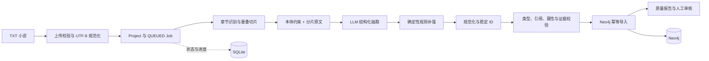
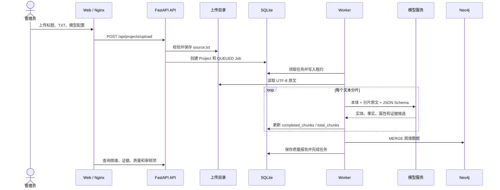
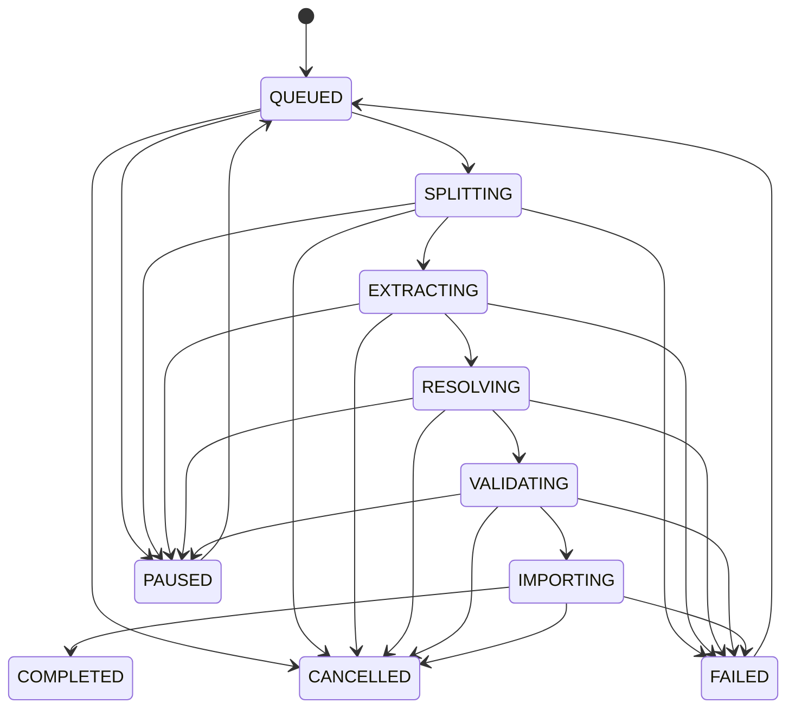
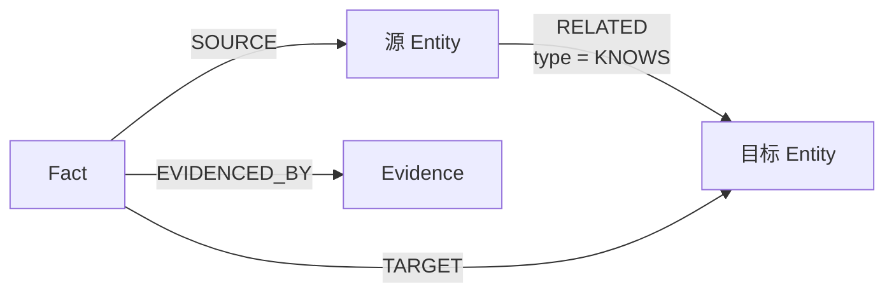
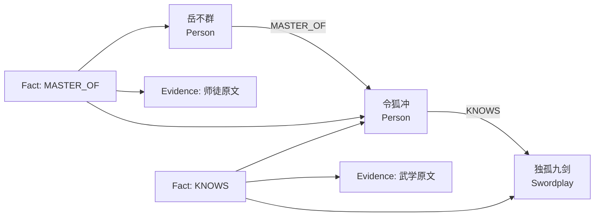

# 江湖图谱信息抽取与图谱构建完整过程

版本：1.0

更新日期：2026-07-17

适用版本：当前 `master`（基线提交 `ab6f769`）

相关文档：[系统架构设计](system-architecture-design.md) · [数据库设计](database-design.md) · [Docker 部署手册](deployment-docker-azure-openai.md)

## 1. 文档目标

本文档完整说明一部 TXT 小说如何在江湖图谱系统中转化为可查询、可审核、可追溯的知识图谱，兼顾两类读者：

- 对产品、教学和本体学习者，解释“本体、实体、关系、属性、事实、证据”如何协同；
- 对开发和运维人员，说明当前代码中的任务状态、模型契约、规范化规则、Neo4j 写入、质量报告和故障排查方法。

本文档描述的是**当前已经实现的流程**。文中使用以下标记：

- **当前实现**：可以在当前代码中直接核对；
- **逻辑阶段**：从数据处理职责理解的阶段，不一定对应一个独立进程或事务；
- **建议**：后续演进方向，不应理解为当前能力。

> 本系统使用 Neo4j 属性图保存实例数据，不是 RDF 三元组库。本体定义“允许出现什么”，图谱保存“小说中实际抽取出了什么”。

## 2. 一句话理解完整过程

系统先把上传小说统一转为 UTF-8 原文，然后按章节和重叠窗口切片；每个分片连同本体约束发送给模型，获得结构化的实体、关系事实、属性和证据候选；候选数据经过规则补强、类型校验、证据对齐、稳定 ID 生成和去重后，使用约束与 `MERGE` 幂等写入 Neo4j；任务状态、进度、错误和质量报告则写入 SQLite。



## 3. 核心概念

### 3.1 本体

本体是抽取和图谱的结构合同，当前定义位于 [`ontology/catalog.py`](../apps/api/src/app/ontology/catalog.py)。它规定：

- 实体类型，例如人物 `Person`、门派 `Sect`、武学 `MartialArt`、事件 `Event`；
- 关系类型，例如师徒 `MASTER_OF`、隶属 `MEMBER_OF`、掌握 `KNOWS`；
- 关系方向、允许的主体类型和客体类型；
- 实体类型可拥有的属性，例如人物的性别、称号和身份；
- 属性的数据类型、枚举范围以及是否允许多值。

本体回答的是“什么样的数据才有资格进入图谱”，而不是“小说中一定存在这些数据”。

### 3.2 实体、关系事实与属性断言

| 概念 | 示例 | 当前存储 |
| --- | --- | --- |
| 实体 | `令狐冲`，类型为 `Person` | Neo4j `Entity` 节点 |
| 关系事实 | `令狐冲 -[KNOWS]-> 独孤九剑` | `Fact` 节点和 `RELATED` 投影关系 |
| 属性断言 | `令狐冲.gender = 男` | `AttributeAssertion` 节点 |
| 原文证据 | “令狐冲使出独孤九剑……”及字符偏移 | `Evidence` 节点 |
| 章节 | 第几章、章节标题 | `Chapter` 节点 |

属性和关系不能互相替代。例如“令狐冲的师父是岳不群”应建模为人物之间的 `MASTER_OF` 关系，而不是把“岳不群”写入令狐冲的“身份”属性。

### 3.3 候选数据与已接受数据

模型输出只是候选数据。只有满足以下条件的数据才会进入最终导入文档：

1. JSON 结构符合抽取契约；
2. 实体类型、关系类型和属性 ID 属于本体；
3. 关系引用的实体存在于同一分片输出；
4. 证据可以在当前分片原文中逐字定位；
5. 属性值符合枚举、数字、布尔值或文本约束；
6. 属性值没有错误承载本应建模为关系的语义。

## 4. 组件与存储分工



| 组件或存储 | 在构建流程中的职责 |
| --- | --- |
| Web | 收集上传参数，展示状态、进度和质量结果 |
| API | 校验上传、创建项目和任务、提供 SSE 事件流 |
| Worker | 领取任务、读取原文、运行抽取流水线、写图和质量报告 |
| 上传目录 | 保存统一为 UTF-8 的项目原文，支持重试和属性补抽 |
| SQLite | 保存项目元数据、任务、租约、进度、事件和质量报告 |
| 模型服务 | 按严格 JSON Schema 返回候选实体、事实、属性和证据 |
| Neo4j | 保存章节、实体、事实、关系投影、属性断言和原文证据 |

## 5. 阶段一：上传、编码识别与项目创建

### 5.1 输入限制

上传入口为 `POST /api/projects/upload`，要求管理员已经登录。请求使用 `multipart/form-data`，包含：

- `title`：1～300 个字符；
- `model_profile_id`：已配置且存在的模型档案 ID；
- `file`：扩展名必须为 `.txt`；
- 默认文件大小不得超过 20 MiB，可通过 `MAX_UPLOAD_BYTES` 调整。

上传实现位于 [`projects/files.py`](../apps/api/src/app/projects/files.py) 和 [`projects/router.py`](../apps/api/src/app/projects/router.py)。

### 5.2 编码识别顺序

系统依次尝试：

1. `utf-8-sig`，识别 UTF-8 BOM；
2. `utf-8`；
3. `gb18030`。

三种编码均无法解码时返回 `415 UNSUPPORTED_ENCODING`。成功解码后，系统不保留原编码文件，而是统一写成 UTF-8 的 `source.txt`。项目表同时保存：

- 原始上传字节数；
- 原始内容 SHA-256；
- 被识别出的编码标签；
- 相对于上传根目录的源文件路径。

这种设计使 Worker 不必在每次重试时重复猜测编码，也保证字符偏移基于同一份规范化文本计算。

### 5.3 原子性边界与清理

项目上传涉及文件系统和 SQLite，无法放进同一个数据库事务。当前处理顺序为：

1. 生成 `project-<uuid>`；
2. 创建项目目录并写入 `source.txt`；
3. 创建 SQLite 项目记录；
4. 创建 `QUEUED` 构建任务。

若项目记录或任务创建失败，服务会尽量删除已经创建的文件和项目记录。它是补偿式清理，不是跨存储事务。

## 6. 阶段二：任务排队、领取与状态机

### 6.1 任务种类

| 任务类型 | 含义 |
| --- | --- |
| `FULL_BUILD` | 从原文抽取实体、关系、属性和证据，并构建完整项目图 |
| `ATTRIBUTE_BACKFILL` | 重新读取原文，仅补抽已有实体的属性和属性证据 |

同一项目同时只能存在一个非终态任务。创建第二个活动任务会返回 `PROJECT_JOB_IN_PROGRESS`。

### 6.2 状态机



状态定义和转换规则位于 [`jobs/models.py`](../apps/api/src/app/jobs/models.py)。

### 6.3 Worker 领取和租约

Worker 使用 SQLite `BEGIN IMMEDIATE` 领取最早创建的可用任务：

- 排除 `COMPLETED`、`FAILED` 和 `CANCELLED`；
- 排除 `PAUSED`；
- 只领取没有 Worker 或租约已经过期的任务；
- 首次领取 `QUEUED` 任务时改为 `SPLITTING`；
- 写入 `worker_id` 和 `lease_expires_at`。

租约使 Worker 异常退出后任务可以被重新领取，但当前处理并不是分片级持久化断点续跑；重新领取后，流水线会重新读取原文并重新处理任务。Neo4j 的稳定 ID 和 `MERGE` 用于降低重复写入的副作用。

### 6.4 逻辑阶段与当前调度实现的区别

页面和数据模型显示了 `SPLITTING → EXTRACTING → RESOLVING → VALIDATING → IMPORTING`，这些状态表达了正确的**逻辑流水线**。

但在当前 [`worker/online.py`](../apps/api/src/app/worker/online.py) 中：

- `SPLITTING`、`EXTRACTING`、`RESOLVING`、`VALIDATING` 的 handler 是快速检查点；
- 真正的分章、逐分片模型调用、规范化、校验和图导入统一在 `IMPORTING` handler 内调用 `ExtractionPipeline.process()` 完成；
- 因此构建页面可能快速越过前几个状态，较长时间停留在 `IMPORTING`。

这不影响数据处理顺序，但意味着当前阶段状态不是各阶段真实耗时的精确度量。后续若需要逐阶段可恢复和准确耗时，应把流水线拆成持久化的独立阶段。

## 7. 阶段三：章节识别与文本切片

文本切分实现位于 [`extraction/splitter.py`](../apps/api/src/app/extraction/splitter.py)。

### 7.1 章节识别

系统通过正则识别形如以下标题的独立行：

```text
第一章 灭门
第十回 比剑
第12节 决战
```

规则支持中文数字、阿拉伯数字以及“章、节、回”。如果没有识别到任何章节，全文会被视为第 1 章“正文”；首个标题前存在非空内容时，会生成“序言”章节。

每个章节记录：

- 顺序号；
- 标题；
- 在整部规范化原文中的起止字符偏移；
- 章节正文。

### 7.2 分片窗口

默认参数为：

- 最大分片长度 `4000` 个字符；
- 相邻分片重叠 `300` 个字符。

当章节超过最大长度时，切分器优先在后半窗口中的以下边界截断：

1. 空行；
2. 中文句号 `。`；
3. 换行；
4. 若没有合适边界，则在硬上限截断。

重叠窗口降低关系证据刚好跨越分片边界而丢失的概率。代价是重叠区内容可能被抽取两次，因此后续必须使用稳定 ID 和证据合并去重。

### 7.3 字符偏移

每个 `TextChunk` 同时保存：

- 分片 ID，例如 `chapter-1-chunk-3`；
- 章节号；
- 相对于整部原文的 `start_offset` 和 `end_offset`；
- 分片文本。

模型返回的证据偏移是**相对于当前分片**的。规范化阶段会将其换算为整部原文绝对偏移：

```text
absolute_start = chunk.start_offset + evidence.start
absolute_end   = chunk.start_offset + evidence.end
```

## 8. 阶段四：用本体构造抽取请求

每个分片被包装为 `ExtractionRequest`：

```json
{
  "project_id": "project-example",
  "chunk_id": "chapter-1-chunk-1",
  "text": "分片原文……",
  "ontology": {
    "entity_types": ["Person", "Sect", "MartialArt"],
    "relation_types": ["MASTER_OF", "MEMBER_OF", "KNOWS"],
    "property_definitions": {}
  }
}
```

实际请求会带上完整本体目录中的实体类型、关系类型和有效属性定义。

### 8.1 提示词中的关键约束

[`extraction/prompting.py`](../apps/api/src/app/extraction/prompting.py) 会动态生成系统提示词，主要约束包括：

- 只能抽取原文明确支持的内容，不能补小说常识；
- 实体名称必须在文本中出现；
- 关系必须使用本体允许的类型和方向；
- `MASTER_OF` 固定为“师父 → 徒弟”；
- `MEMBER_OF` 固定为“人物 → 组织”；
- `KNOWS` 固定为“人物 → 武学”；
- 每条事实和属性必须带最短、逐字一致的证据；提示词要求少于 500 字，服务端校验上限为 500 字；
- 人物、组织或武学之间的语义不能错误塞进普通文本属性。

### 8.2 结构化输出契约

模型必须返回：

```json
{
  "entities": [],
  "facts": [],
  "attributes": []
}
```

三类候选记录的核心字段如下。

#### 候选实体

```json
{
  "local_id": "person_1",
  "name": "令狐冲",
  "type": "Person",
  "aliases": ["令狐少侠"]
}
```

`local_id` 只在当前分片响应内建立引用，不直接成为最终图谱 ID。

#### 候选事实

```json
{
  "relation": "KNOWS",
  "source_local_id": "person_1",
  "target_local_id": "art_1",
  "evidence": {
    "start": 18,
    "end": 32,
    "quote": "令狐冲使出独孤九剑"
  },
  "confidence": 0.96
}
```

#### 候选属性

```json
{
  "entity_local_id": "person_1",
  "property_id": "gender",
  "value": "男",
  "evidence": {
    "start": 40,
    "end": 45,
    "quote": "这少年"
  },
  "confidence": 0.9
}
```

Pydantic 模型限制每个分片最多返回 100 个实体、200 条事实和 200 条属性，阻止无限膨胀的响应进入后续处理。

## 9. 阶段五：模型适配与调用

模型注册表位于 [`extraction/providers.py`](../apps/api/src/app/extraction/providers.py)，支持：

| Provider | 请求方式 | 结构化输出 |
| --- | --- | --- |
| Azure OpenAI | deployment-scoped Chat Completions，`api-key` | strict JSON Schema |
| OpenAI-compatible | `/chat/completions`，Bearer Token | strict JSON Schema |
| Ollama | `/api/chat` | `format` 传 JSON Schema，温度为 0 |
| Fixed | 确定性测试实现 | 测试固定结果 |

模型档案只保存密钥环境变量名，密钥由 Worker 从环境变量读取。缺少密钥时返回 `MODEL_API_KEY_MISSING`，未知档案返回 `UNKNOWN_MODEL_PROFILE`。

### 9.1 Azure OpenAI 请求地址

Azure OpenAI 使用：

```text
{base_url}/openai/deployments/{deployment}/chat/completions
    ?api-version={api_version}
```

其中 `base_url` 是 Azure 资源端点，`model` 字段在该 Provider 下表示**部署名**，而不只是基础模型名称。

### 9.2 模型错误分类与重试

Provider 把错误归为三类：

| 类型 | 典型情况 | 流水线行为 |
| --- | --- | --- |
| `RETRYABLE` | HTTP 429、HTTP 5xx、网络错误 | 有限次数指数退避后重试 |
| `CONFIGURATION` | 其他 HTTP 4xx、缺少密钥、未知配置 | 任务失败 |
| `INVALID_RESPONSE` | JSON、字段或结构不合法 | 任务失败，内容过滤除外 |

默认最多重试 3 次。若响应包含 `retry-after-ms`、`x-ms-retry-after-ms` 或 `retry-after`，优先使用服务端建议时间；否则使用指数退避并封顶 60 秒。

Azure 内容过滤被识别为 `MODEL_CONTENT_FILTER`。当前流水线会跳过该分片、记录失败分片和拒绝码，然后继续处理其他分片，而不是让整本小说立即失败。

## 10. 阶段六：确定性规则补强

LLM 抽取完成后，完整构建会运行 [`extraction/rules.py`](../apps/api/src/app/extraction/rules.py) 中的规则抽取器。

当前规则覆盖两类高价值关系：

- 师父、师傅、师尊等表达，补充 `MASTER_OF`；
- 妻子、丈夫、夫人等表达，补充 `SPOUSE_OF`。

规则会：

1. 在分片中匹配明确句式；
2. 为缺少的角色生成 `Person` 候选实体；
3. 生成带精确字符偏移的候选事实；
4. 按“关系 + 源局部 ID + 目标局部 ID + 证据”去重；
5. 与 LLM 结果合并后进入统一规范化流程。

规则的价值不是替代 LLM，而是为方向明确、模式稳定的关系提供高精度兜底。属性补抽任务不会运行这组关系规则，因为它不应改写实体或事实。

## 11. 阶段七：规范化、证据对齐和拒绝

规范化实现位于 [`extraction/normalize.py`](../apps/api/src/app/extraction/normalize.py)。这是模型候选进入图谱前最重要的质量闸门。

### 11.1 实体规范化

对每个实体：

1. 去除 `local_id`、名称和类型两侧空白；
2. 拒绝空局部 ID、空名称和空类型；
3. 将类型字符串转换为本体 `EntityType`；
4. 未知类型记为 `UNKNOWN_ENTITY_TYPE`；
5. 清洗、去重并排序别名；
6. 生成项目隔离的稳定实体 ID。

实体 ID 形式为：

```text
{project_id}:{entity_type}:{sha256(name) 前 16 位}
```

因此在**同一项目、同一类型、完全相同名称**下，不同分片会得到同一个实体 ID。不同项目中的同名人物不会串图。

### 11.2 当前实体解析边界

当前完整构建没有通用的语义实体链接模型。它主要依赖：

- 项目 ID；
- 实体类型；
- 规范化前的精确名称；
- 稳定哈希 ID。

因此“令狐冲”和错误识别的“令狐中”会成为两个实体；繁简体、别称和描述性短语也可能造成重复。系统通过别名、审核扫描和人工合并处理这些情况，而不是在自动抽取阶段冒险合并。

### 11.3 关系事实规范化

对每条关系事实：

1. 校验关系类型是否属于 `RelationType`；
2. 解析源、目标 `local_id`；
3. 任一引用不存在时拒绝为 `UNKNOWN_FACT_ENTITY`；
4. 校验证据；
5. 生成稳定事实 ID；
6. 保存关系类型、源实体、目标实体、章节号、置信度和证据 ID。

事实 ID 由“关系类型 + 源实体 ID + 目标实体 ID”计算。因此同一关系在多个分片重复出现时会合并为同一事实，并汇总多个证据 ID。

### 11.4 属性规范化

对每条属性断言：

1. 找到当前分片内对应实体；
2. 根据实体类型查找有效属性定义，包含从父类继承的属性；
3. 校验并规范化属性值；
4. 拒绝把另一个实体名称或纯关系角色当作属性值；
5. 校验证据；
6. 生成稳定属性断言 ID。

属性 ID 由“项目 + 实体 + 属性 ID + 属性值”计算。相同属性值可汇总来自多个分片的证据。

属性值规则包括：

- `TEXT`：去除两侧空白，不允许空值；
- `ENUM`：必须属于本体枚举，例如人物性别只能是“男”或“女”；
- `NUMBER`：必须可解析为有限十进制数，并规范化多余的零；
- `BOOLEAN`：规范化为小写 `true` 或 `false`；
- 另一个实体名称、师父/妻子/成员等关系角色不能作为普通属性值。

### 11.5 证据对齐

证据是系统实现“答案不是猜出来的”的基础。规范化器按以下顺序处理：

1. `quote` 不能为空且不能超过 500 字；
2. 若 `chunk[start:end] == quote`，直接接受；
3. 若模型偏移不准但 `quote` 在分片中出现，则寻找距离模型起点最近的一次精确出现并修正偏移；
4. 若分片中找不到逐字相同的 `quote`，拒绝该事实或属性；
5. 把分片相对偏移换算成全文绝对偏移；
6. 使用“绝对起点 + 绝对终点 + 原文摘录”生成稳定证据 ID；
7. 保存原文摘录 SHA-256，供完整性检查。

注意：模型 Provider 当前不在响应解析后调用 `ExtractionResult.validate_for_chunk()`；精确证据校验与有限纠偏实际由规范化器完成。

### 11.6 常见拒绝码

| 拒绝码 | 含义 |
| --- | --- |
| `EMPTY_ENTITY_LOCAL_ID` | 实体局部 ID 为空 |
| `EMPTY_ENTITY_NAME` | 实体名称为空 |
| `UNKNOWN_ENTITY_TYPE` | 本体中不存在该实体类型 |
| `UNKNOWN_RELATION_TYPE` | 本体中不存在该关系类型 |
| `UNKNOWN_FACT_ENTITY` | 事实引用了未输出的实体 |
| `EVIDENCE_MISMATCH` | 事实证据无法在分片中逐字定位 |
| `EVIDENCE_TOO_LONG` | 事实证据超过 500 字 |
| `UNKNOWN_ENTITY_PROPERTY` | 实体类型不允许该属性 |
| `INVALID_ATTRIBUTE_ENUM` | 枚举属性值不在允许范围 |
| `INVALID_ATTRIBUTE_NUMBER` | 数值属性不是有效有限数值 |
| `INVALID_ATTRIBUTE_BOOLEAN` | 布尔属性不是 `true/false` |
| `RELATION_SEMANTIC_ATTRIBUTE` | 把关系语义错误建模为属性 |
| `ATTRIBUTE_EVIDENCE_MISMATCH` | 属性证据无法在分片中定位 |
| `MODEL_CONTENT_FILTER` | 模型服务过滤了该分片 |

被拒绝的候选不会进入 `GraphDocument`，但拒绝码会累计到任务质量报告。

## 12. 阶段八：跨分片聚合与图文档组装

流水线在内存中维护四个按稳定 ID 索引的集合：

- `entities`；
- `facts`；
- `attributes`；
- `evidence`。

聚合行为如下：

- 相同实体 ID 后出现的记录覆盖前一记录；
- 相同事实 ID 会合并并排序证据 ID；
- 相同属性断言 ID会合并并排序证据 ID；
- 相同证据 ID只保留一份。

处理完所有分片后，流水线组装 `GraphDocument`：

```text
GraphDocument
├── ProjectRecord
├── ChapterRecord[]
├── EntityRecord[]
├── FactRecord[]
├── AttributeAssertionRecord[]
└── EvidenceRecord[]
```

Pydantic 的最终引用校验确保：

- 每条事实引用的源实体和目标实体存在；
- 每条属性引用的实体存在；
- 事实和属性引用的证据存在；
- 每条证据引用的章节存在。

## 13. 阶段九：Neo4j 图谱导入

导入实现位于 [`graph/importer.py`](../apps/api/src/app/graph/importer.py) 和 [`graph/neo4j.py`](../apps/api/src/app/graph/neo4j.py)。

### 13.1 导入顺序

完整构建依次执行：

1. 创建约束和索引；
2. `MERGE` Project；
3. `MERGE` Chapter，并建立 `Project-[:HAS_CHAPTER]->Chapter`；
4. `MERGE` Entity，并建立 `Project-[:HAS_ENTITY]->Entity`；
5. 解析属性所属的规范实体；
6. 导入被事实或有效属性引用的 Evidence；
7. 导入 AttributeAssertion 及证据边；
8. 导入 Fact、源目标连接、查询投影关系和事实证据边。

### 13.2 为什么同时有 Fact 节点和 RELATED 关系

每个事实同时表示为：



- `RELATED` 方便图谱页面快速做邻域遍历；
- `Fact` 节点可以承载事实 ID、审核状态、多条证据和时间范围；
- 两者共享同一个事实 ID，审核接受或拒绝时同步更新。

### 13.3 约束与索引

Neo4j 为 Project、Chapter、Entity、Fact、Evidence 和 AttributeAssertion 创建唯一约束，并为 `(project_id, name)`、`(project_id, type)` 创建实体索引。

除 Project 外，业务节点都以 `(project_id, id)` 隔离。所有写入查询必须携带项目 ID。

### 13.4 幂等与批处理

- 节点和关系使用稳定业务 ID与 `MERGE`；
- 默认每批最多写入 500 行；
- 重叠分片、任务重试或 Worker 接管不会按次数无限复制相同事实；
- `nodes_created` 用于形成导入摘要。

幂等并不等于全量替换。当前完整构建是 upsert，不会自动删除“上一次构建存在、这一次没有输出”的旧节点或旧事实。

### 13.5 属性实体解析

属性导入会先把抽取实体提示映射到现有规范实体：

1. 优先使用稳定实体 ID且类型相同；
2. 若稳定 ID不存在，按同项目、同类型、名称或别名匹配；
3. 只有唯一候选时才接受；
4. 已标记 `MERGED` 的实体不会作为目标；
5. 无法唯一解析的属性不会导入。

这使属性补抽可以把新抽出的属性挂回已审核、已合并后的实体，而不重建实体。

## 14. 阶段十：进度、取消与任务事件

### 14.1 进度计算

分片完成度是当前真实进度指标：

```text
progress = completed_chunks / total_chunks
```

流水线开始时写入 `(0, total_chunks)`；每个分片处理成功、被内容过滤跳过或完成规范化后都会更新一次。更新规则禁止：

- 完成数小于 0；
- 总数小于 0；
- 完成数大于总数；
- 完成数或总数倒退。

### 14.2 SSE 事件流

每次任务创建、状态变化或进度变化都会向 `job_events` 追加快照。前端通过：

```text
GET /api/jobs/{job_id}/events
```

读取 Server-Sent Events。客户端可携带 `Last-Event-ID` 从指定序号后继续接收。服务端每 250 毫秒检查一次新事件，遇到终态后关闭事件流。

### 14.3 取消边界

流水线在以下安全点检查取消：

- 处理每个分片之前；
- 更新每个分片进度之后；
- 组装和导入最终文档之前。

取消不是强行中断正在进行的 HTTP 模型请求；它会在当前请求返回后的安全边界生效。当全部分片已经处理完并进入最终导入阶段时，服务会拒绝取消，避免把已完成导入误标为取消。

## 15. 阶段十一：质量报告

任务完成后，Worker 把 `QualityReport` 保存到 SQLite `job_quality`：

```json
{
  "total_chunks": 40,
  "successful_chunks": 38,
  "failed_chunks": 2,
  "accepted_entities": 37,
  "accepted_facts": 12,
  "accepted_evidence": 15,
  "accepted_attributes": 24,
  "accepted_attribute_evidence": 26,
  "ambiguous_entities": 0,
  "rejected_by_code": {
    "EVIDENCE_MISMATCH": 2,
    "MODEL_CONTENT_FILTER": 2
  },
  "model_calls": 40,
  "retry_count": 3
}
```

字段解释：

| 字段 | 说明 |
| --- | --- |
| `total_chunks` | 分片总数 |
| `successful_chunks` | 得到可解析模型响应的分片数 |
| `failed_chunks` | 当前主要统计被内容过滤跳过的分片 |
| `accepted_entities` | 完整构建汇总的实体数；属性补抽为 0 |
| `accepted_facts` | 完整构建汇总的事实数；属性补抽为 0 |
| `accepted_evidence` | 实际保留并被引用的证据数 |
| `accepted_attributes` | 实际保留的属性断言数 |
| `rejected_by_code` | 规范化和模型过滤阶段的拒绝原因计数 |
| `model_calls` | 当前等于分片总数，不包含重试次数 |
| `retry_count` | 所有分片发生的重试总次数 |

`ambiguous_entities` 当前预留但流水线尚未累计实际歧义数，因此通常为 0。

## 16. 阶段十二：人工审核与实体治理

构建完成不等于所有事实都经过人工确认。审核扫描需要管理员主动调用审核接口或在审核界面触发。

### 16.1 规则扫描

审核扫描当前识别：

- 低置信度事实，默认阈值低于 0.65；
- 缺少证据的事实；
- 关系主体或客体类型违反本体；
- 同类型、同规范化名称的可能重复实体。

### 16.2 审核动作

审核员可以：

- 接受事实；
- 拒绝事实；
- 合并重复实体；
- 从实体别名中拆出独立实体；
- 忽略审核项。

被拒绝的事实不会出现在默认图谱和问答结果中，但事实节点、证据和审核审计记录仍保留。实体合并会把关系、事实、别名和相关引用迁移到目标实体，并把源实体标记为 `MERGED`。

### 16.3 自动去重与人工合并的边界

系统只自动合并“同项目 + 同类型 + 完全相同名称”产生的稳定 ID。以下情况通常需要人工审核：

- 错别字：`令狐中` 与 `令狐冲`；
- 繁简体差异；
- 别称与本名；
- 带角色描述的伪实体，例如“令狐冲的师父”；
- 同名但实际上是不同角色。

保守合并可以避免错误地把两个真实不同的人物永久合成一个。

## 17. 属性补抽与完整重建

### 17.1 属性补抽不需要重新上传原文

只要项目上传目录中的 `source.txt` 仍存在，就可以创建 `ATTRIBUTE_BACKFILL` 任务。它会重新分章、分片和调用模型，但：

- 不运行关系规则补强；
- 不导入新实体；
- 不导入或重写 Fact；
- 只导入能唯一映射到现有实体的属性和属性证据；
- 不修改已有审核状态。

### 17.2 什么时候需要完整重建

以下情况通常需要新建完整项目或设计受控重建：

- 原始小说文本发生变化；
- 本体新增实体或关系类型；
- 提示词和关系抽取策略大幅调整；
- 需要清理旧抽取结果中已经不再输出的实体或事实。

当前上传会创建新的项目 ID。当前系统没有“原项目先清空、再原位完整重建”的原子流程。

## 18. 贯穿示例：从一句原文到图谱

假设分片原文为：

```text
岳不群是令狐冲的师父。令狐冲使出独孤九剑迎敌。
```

### 18.1 模型或规则产生候选

```json
{
  "entities": [
    {"local_id": "p1", "name": "岳不群", "type": "Person", "aliases": []},
    {"local_id": "p2", "name": "令狐冲", "type": "Person", "aliases": []},
    {"local_id": "m1", "name": "独孤九剑", "type": "Swordplay", "aliases": []}
  ],
  "facts": [
    {
      "relation": "MASTER_OF",
      "source_local_id": "p1",
      "target_local_id": "p2",
      "evidence": {"start": 0, "end": 10, "quote": "岳不群是令狐冲的师父"},
      "confidence": 0.98
    },
    {
      "relation": "KNOWS",
      "source_local_id": "p2",
      "target_local_id": "m1",
      "evidence": {"start": 11, "end": 20, "quote": "令狐冲使出独孤九剑"},
      "confidence": 0.94
    }
  ],
  "attributes": []
}
```

### 18.2 规范化结果

- `p1`、`p2`、`m1` 被转换为项目隔离的稳定实体 ID；
- 两段证据转换为全文绝对偏移并生成证据 ID；
- `MASTER_OF` 的方向校验为岳不群 → 令狐冲；
- `KNOWS` 的方向为令狐冲 → 独孤九剑；
- 事实 ID不包含证据 ID，因此其他章节再次证明同一事实时会合并证据。

### 18.3 Neo4j 结果



用户点击关系时，系统通过 Fact 找到 Evidence，再通过 Evidence 的章节和字符偏移回到原文。这就是图谱“可解释”和“可审核”的基础。

## 19. 失败模式与处理策略

| 现象或错误码 | 常见原因 | 系统行为 | 排查重点 |
| --- | --- | --- | --- |
| `UNSUPPORTED_ENCODING` | 不是 UTF-8/BOM/GB18030 | 上传返回 415 | 用编辑器转为 UTF-8 后重新上传 |
| `FILE_TOO_LARGE` | 超过上传上限 | 上传返回 413 | 文件大小和 `MAX_UPLOAD_BYTES` |
| `UNKNOWN_MODEL_PROFILE` | 前后端配置不一致 | 拒绝创建任务 | Worker/API 的 `MODEL_PROFILES_JSON` |
| `MODEL_API_KEY_MISSING` | 密钥环境变量未注入 | 任务失败 | Worker 容器 `printenv` |
| `MODEL_HTTP_400` | 端点、版本、请求或模型配置错误 | 任务失败 | Worker 日志中的响应摘要 |
| `MODEL_CONTENT_FILTER` | Azure 内容管理策略过滤分片 | 跳过该分片并继续 | 过滤类别、分片文本和质量报告 |
| `MODEL_HTTP_429` | 模型 RPM/TPM 超额 | 退避重试，耗尽后失败 | Azure 配额、并发、Retry-After |
| `MODEL_NETWORK_ERROR` | DNS、TLS、代理或网络超时 | 退避重试 | 容器网络和模型端点连通性 |
| `MODEL_RESPONSE_INVALID` | JSON、字段或类型不符合契约 | 任务失败 | 原始模型响应和 Schema 支持能力 |
| `PROJECT_SOURCE_MISSING` | 上传卷丢失或路径错误 | Worker/补抽失败 | `DATA_ROOT` 和 `app-data` 卷 |
| `WORKER_STAGE_FAILED` | 未分类的 Worker 异常 | 任务失败 | 完整 Worker traceback |
| 长时间 `QUEUED` | Worker 未运行或旧任务占用 | 无人领取任务 | `docker compose ps`、Worker 日志和活动任务 |
| 进度为 0 | 仍在模型首次调用，或前几个检查点快速通过 | 页面暂无分片完成 | Worker 日志、SSE、任务表中的分片数 |

## 20. 运维排查清单

### 20.1 服务状态

```bash
sudo docker compose ps
sudo docker compose logs --tail=200 worker
sudo docker compose logs --tail=100 api
sudo docker compose logs --tail=100 neo4j
```

### 20.2 核对 Worker 模型配置

```bash
sudo docker compose exec worker printenv MODEL_PROFILES_JSON
sudo docker compose exec worker printenv AZURE_OPENAI_API_KEY
```

第二条命令只用于确认变量是否存在，不应把密钥值复制到工单、截图或日志中。

### 20.3 查询最近任务

```bash
sudo docker compose exec -T api python - <<'PY'
import os, sqlite3

raw = os.getenv("SQLITE_URL", "sqlite:////data/tspw-graph.db")
path = raw.removeprefix("sqlite:///")
conn = sqlite3.connect(path)

for row in conn.execute("""
select id, project_id, model_profile_id, kind, status, error_code,
       worker_id, completed_chunks, total_chunks, updated_at
from jobs
order by created_at desc
limit 20
"""):
    print(row)
PY
```

### 20.4 查询项目图谱数量

```bash
sudo docker compose exec -T neo4j cypher-shell \
  -u neo4j -p "$NEO4J_PASSWORD" \
  "MATCH (e:Entity {project_id: 'project-id'})
   WITH count(e) AS entities
   MATCH ()-[r:RELATED {project_id: 'project-id'}]->()
   RETURN entities, count(r) AS relations;"
```

### 20.5 判断问题在哪一层

```text
上传失败
  └─ 检查扩展名、大小、编码和 multipart/form-data

任务一直排队
  └─ 检查 Worker、租约、旧活动任务和 SQLite 共享卷

模型调用失败
  └─ 检查档案、密钥、端点、部署名、API 版本、429 和内容过滤

任务完成但图谱为空
  └─ 检查质量报告、拒绝码、Neo4j 连接和项目 ID

图谱有实体但问答无答案
  └─ 检查关系方向、审核状态、属性/关系问句模板和证据是否保留

出现重复实体
  └─ 检查名称差异、类型差异、别名并进入人工合并审核
```

## 21. 安全与数据边界

- 上传、构建、属性补抽、任务控制和审核要求管理员登录；
- 模型密钥只从环境变量读取，不写入项目、任务或质量报告；
- API 返回的模型档案只暴露密钥是否可用，不返回密钥值；
- 上传路径通过项目 ID格式和 `resolve()` 后的根目录父子关系防止目录穿越；
- 日志应记录状态码和响应摘要，不应记录 API Key；
- 小说原文会发送到所选外部模型服务，部署前必须确认数据合规和内容策略；
- SQLite、上传目录和 Neo4j 必须一起备份，单独备份任一存储都不能完整恢复项目。

## 22. 当前实现边界与建议演进

### 22.1 当前边界

1. 状态机阶段与真实计算阶段尚未一一拆分；
2. 完整构建以精确名称生成实体 ID，缺少自动语义实体链接；
3. 模型响应的关系源/目标类型主要在审核扫描中发现本体违规，规范化阶段只校验关系枚举和实体引用；
4. 完整构建是 upsert，不会清除旧图中的过期数据；
5. 分片处理结果没有逐片持久化，Worker 接管后可能重新调用模型；
6. 内容过滤分片被跳过后不会自动采用更小窗口再次尝试；
7. 质量报告的 `ambiguous_entities` 尚未接入真实统计；
8. 审核扫描需要单独触发，不是构建完成后的自动阶段。
9. Worker 处理长任务时当前没有周期性续租心跳；单 Worker 部署不受影响，但直接横向扩展多个 Worker 前应先补充租约续期，避免超过租约时间的任务被重复领取。

### 22.2 建议演进

- 将切分、抽取、解析、校验和导入拆成可恢复的持久化阶段；
- 保存每个分片的内容哈希、模型版本、抽取结果和处理状态，支持断点续跑；
- 引入规范名称、别名字典、繁简转换和人工确认结合的实体链接策略；
- 在规范化阶段直接校验关系 source/target 类型；
- 为原项目重建增加 staging 图、版本号和原子切换，避免旧数据残留；
- 对内容过滤分片尝试更小窗口或安全的结构化摘要策略；
- 增加模型调用耗时、Token、429、内容过滤率和每类拒绝率监控；
- 构建完成后自动生成审核项，但保留管理员确认入口；
- 增加端到端回归语料，衡量实体、关系、属性和证据的准确率与召回率。

## 23. 代码导航

| 职责 | 主要文件 |
| --- | --- |
| 上传、编码与保存 | [`projects/files.py`](../apps/api/src/app/projects/files.py) |
| 项目和任务创建接口 | [`projects/router.py`](../apps/api/src/app/projects/router.py) |
| 任务模型与状态机 | [`jobs/models.py`](../apps/api/src/app/jobs/models.py) |
| 任务领取、租约、进度和事件 | [`jobs/repository.py`](../apps/api/src/app/jobs/repository.py) |
| SSE 和任务操作接口 | [`jobs/router.py`](../apps/api/src/app/jobs/router.py) |
| Worker 调度 | [`worker/runner.py`](../apps/api/src/app/worker/runner.py) |
| 在线构建 handler | [`worker/online.py`](../apps/api/src/app/worker/online.py) |
| 章节与分片 | [`extraction/splitter.py`](../apps/api/src/app/extraction/splitter.py) |
| 抽取数据契约 | [`extraction/models.py`](../apps/api/src/app/extraction/models.py) |
| 本体驱动提示词 | [`extraction/prompting.py`](../apps/api/src/app/extraction/prompting.py) |
| 模型注册和错误分类 | [`extraction/providers.py`](../apps/api/src/app/extraction/providers.py) |
| Azure OpenAI 调用 | [`extraction/azure_openai.py`](../apps/api/src/app/extraction/azure_openai.py) |
| OpenAI-compatible 调用 | [`extraction/openai_compatible.py`](../apps/api/src/app/extraction/openai_compatible.py) |
| Ollama 调用 | [`extraction/ollama.py`](../apps/api/src/app/extraction/ollama.py) |
| 规则补强 | [`extraction/rules.py`](../apps/api/src/app/extraction/rules.py) |
| 规范化、稳定 ID 和拒绝规则 | [`extraction/normalize.py`](../apps/api/src/app/extraction/normalize.py) |
| 端到端流水线 | [`extraction/pipeline.py`](../apps/api/src/app/extraction/pipeline.py) |
| 本体目录 | [`ontology/catalog.py`](../apps/api/src/app/ontology/catalog.py) |
| 图文档模型 | [`graph/models.py`](../apps/api/src/app/graph/models.py) |
| 图谱导入编排 | [`graph/importer.py`](../apps/api/src/app/graph/importer.py) |
| Neo4j 约束和 Cypher | [`graph/neo4j.py`](../apps/api/src/app/graph/neo4j.py) |
| 审核扫描规则 | [`review/rules.py`](../apps/api/src/app/review/rules.py) |
| 审核动作 | [`review/service.py`](../apps/api/src/app/review/service.py) |

## 24. 总结

江湖图谱的信息抽取不是一次“让模型读小说并输出结果”的调用，而是一条受本体约束、受证据校验、可重试、可审核的数据工程流水线：

```text
原文事实源
  → 可重复的章节和分片
  → 受本体约束的结构化候选
  → 规则补强与严格规范化
  → 项目隔离的稳定实体、事实、属性和证据
  → Neo4j 幂等图谱
  → 质量报告和人工治理
```

其中最重要的原则是：**模型负责提出候选，本体负责限定表达，原文证据负责证明事实，规范化和审核负责决定哪些数据可以被信任。**
