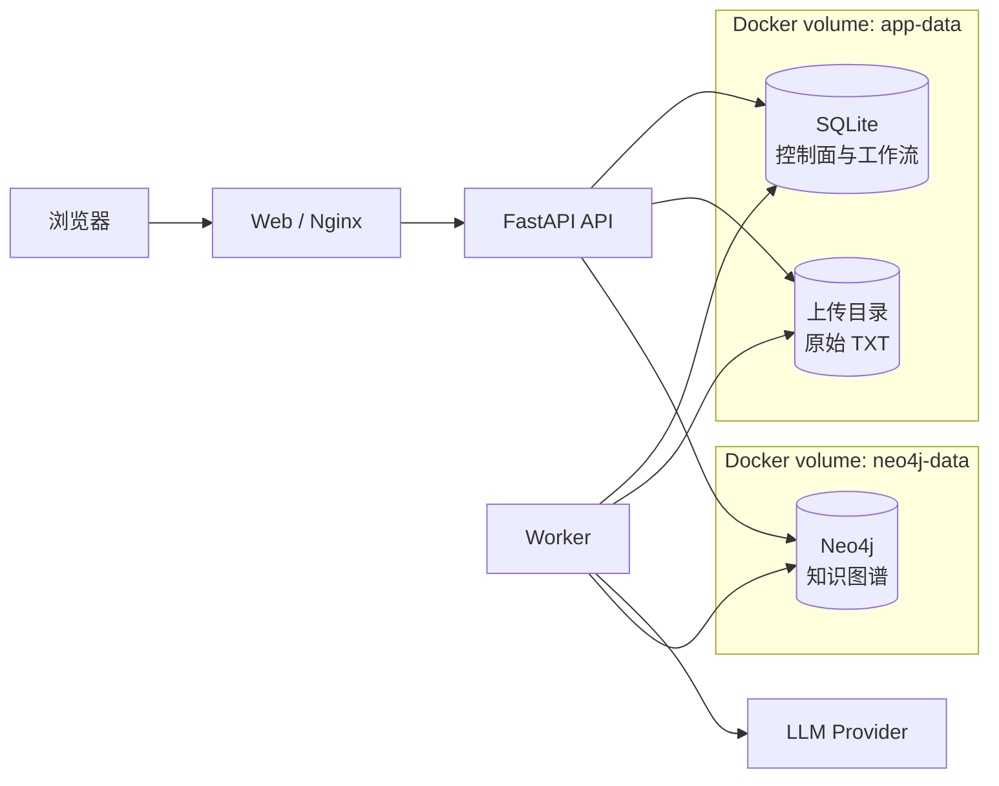
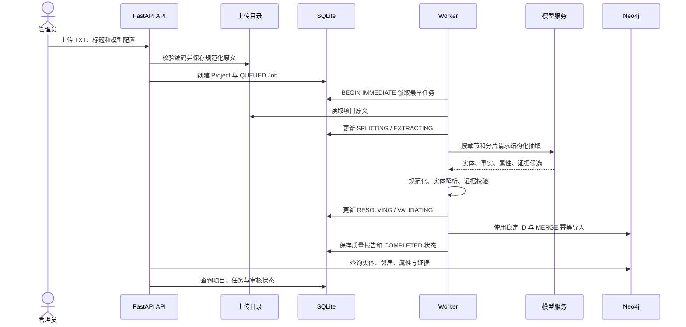
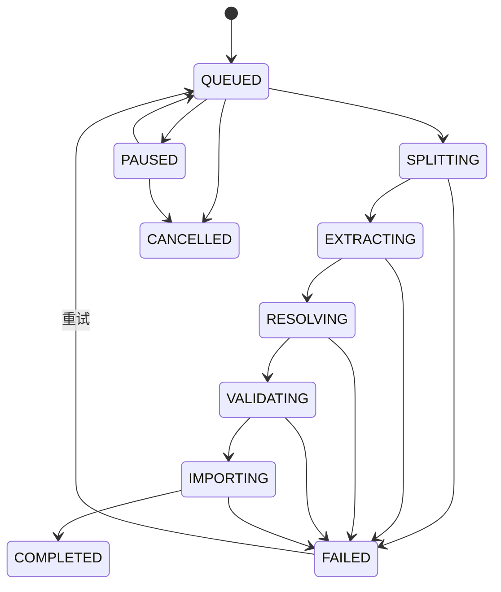

# 江湖图谱系统架构设计

版本：1.0

更新日期：2026-07-16

适用版本：当前 `master`（基线提交 `1b7ddc0`）

相关文档：[数据库设计](database-design.md)

## 1. 文档目标与适用范围

本文档描述江湖图谱网站当前已经实现的系统架构，重点回答：

- Web、API、Worker、SQLite、Neo4j 和模型服务如何协作；
- 小说文本如何经过抽取、校验和导入成为可查询知识图谱；
- 构建、属性补抽、审核、实体治理和项目删除如何改变系统状态；
- 双存储架构如何备份、恢复、监控并控制安全边界。

具体 SQLite 字段、Neo4j 节点与关系、约束、索引及查询示例见[数据库设计](database-design.md)。

本文档使用以下标记：

- **当前实现**：可以在当前代码中直接核对的结构或行为；
- **运行时生成**：由应用启动、任务处理或兼容升级产生；
- **建议**：尚未实现的演进方向，不应理解为系统现状。

> 系统中的“本体”定义允许的实体类型、关系类型和属性模式；Neo4j 保存这些约束下产生的实例数据。当前图存储是 Neo4j 属性图，而不是 RDF 三元组库。

## 2. 总体系统架构

系统采用前后端分离、异步 Worker 和双数据库协同的架构。



系统把持久化分为三个职责域：

| 存储 | 当前职责 | 不保存的内容 |
| --- | --- | --- |
| SQLite | 项目元数据、任务、任务事件、质量报告、审核队列、管理员、会话、限流和审计 | 图遍历结构、实体邻居和关系证据链 |
| Neo4j | 项目图、章节、实体、事实、属性断言、原文证据和邻域查询投影 | 管理员凭据、任务租约和上传路径 |
| 上传目录 | 用户上传并规范化后的小说 TXT，供完整构建和属性补抽重复读取 | 结构化实体、关系和账号数据 |

任务状态、认证和审核队列适合关系型事务与唯一约束；人物关系、章节证据和多跳邻居适合属性图遍历。两类数据库通过稳定业务 ID 关联，不存在数据库层面的跨库外键。

## 3. 组件职责与部署边界

### 3.1 Web 与 Nginx

- 提供 React 单页应用；
- 将 `/api/` 请求反向代理到 FastAPI；
- 维护当前项目选择、图谱查询、问答、构建和审核交互；
- 不直接连接 SQLite、Neo4j 或模型服务。

### 3.2 FastAPI API

- 接收和校验上传文件、标题与模型配置；
- 创建项目、任务、审核动作和管理员会话；
- 查询项目状态、图谱邻域、属性、事实和证据；
- 执行需要同步反馈的图治理操作；
- 通过认证与 CSRF 保护管理员、构建和审核能力。

### 3.3 Worker

- 从 SQLite 领取排队任务并维护租约；
- 读取上传目录中的规范化原文；
- 分章、分片并调用配置的模型提供方；
- 校验实体、关系、属性和原文证据；
- 使用稳定 ID 和 `MERGE` 向 Neo4j 幂等导入；
- 写回阶段、进度、质量报告和错误码。

### 3.4 SQLite、Neo4j 与上传目录

- SQLite 是控制面和工作流事实源；
- Neo4j 是知识图谱实例和证据链事实源；
- 上传目录是可重复抽取所需的原始文本事实源。

具体数据模型见[数据库设计](database-design.md)。

### 3.5 默认 Docker 部署位置

| 内容 | 容器内位置 | Docker volume |
| --- | --- | --- |
| SQLite 数据库 | `/data/tspw-graph.db` | `app-data` |
| 上传文件根目录 | `/data/uploads` | `app-data` |
| Neo4j 数据目录 | `/data` | `neo4j-data` |

API 和 Worker 共享 `app-data`，因此能看到相同的项目、任务和原始文本。Neo4j 使用独立卷，避免图存储文件与应用文件混放。

## 4. 小说文本进入知识图谱的数据流



关键设计点：

1. 模型输出是候选数据，必须经过结构、引用和证据校验后才能导入。
2. Worker 使用 `worker_id` 和 `lease_expires_at` 领取任务；超时租约可以被其他 Worker 接管。
3. Neo4j 使用稳定业务 ID、复合唯一约束和 `MERGE`，使任务重试尽量幂等。
4. SQLite 与 Neo4j 没有分布式事务，系统通过阶段状态、质量报告、幂等导入和人工重试实现最终一致。
5. Evidence 保存原文摘录、偏移和文本摘要，使图谱事实能够回到章节语境。

## 5. 构建任务生命周期



### 5.1 完整构建

`FULL_BUILD` 会：

- 在 SQLite 创建任务和任务事件；
- 从上传目录读取 UTF-8 规范化后的 `source.txt`；
- 分章、分片并抽取实体、事实、属性和证据；
- 向 Neo4j `MERGE` 项目、章节、实体、证据、属性和事实；
- 保存质量报告并进入 `COMPLETED`。

**当前限制：**导入器是 upsert，不会在同一个项目重新完整构建前清空旧图。新结果中已经消失的旧实体或事实可能继续保留。当前常规上传会创建新项目 ID；若增加“原项目重建”，应先设计版本切换或受控清理策略。

### 5.2 属性补抽

`ATTRIBUTE_BACKFILL` 使用项目已经保存的小说原文，对现有实体补充 AttributeAssertion 和属性 Evidence：

- 不要求再次上传原文；
- 不重写现有实体和 Fact；
- 稳定断言 ID 使相同“实体 + 属性 + 值”复用节点并合并证据；
- 原始上传文件丢失时无法执行补抽。

### 5.3 暂停、失败与重试

- `PAUSED` 任务不被 Worker 领取；恢复后回到 `QUEUED`；
- `FAILED` 保存稳定 `error_code`，可以重新排队或取消；
- Worker 异常时清除租约并写任务事件；
- 429 等可重试模型错误执行有限次数退避；
- `MODEL_RESPONSE_INVALID` 等最终错误通过任务状态和日志暴露。

## 6. 跨存储一致性设计

SQLite、文件系统和 Neo4j 不能参与同一个事务，当前架构采用“控制面状态 + 幂等图写入 + 可重试任务”的最终一致策略。

| 操作 | 首要事实源 | 其他写入 | 一致性风险 |
| --- | --- | --- | --- |
| 上传项目 | SQLite / 上传目录 | 创建排队任务 | 文件成功但 SQLite 失败，或反向部分成功 |
| 图谱构建 | SQLite Job | Neo4j 图节点与关系 | 图写入部分成功但任务失败 |
| 事实审核 | Neo4j Fact / RELATED | SQLite review action | 图已变更但审核项仍开放 |
| 实体合并 | Neo4j | SQLite review action | 合并完成但动作记录失败 |
| 项目删除 | Neo4j、文件、SQLite | 三处顺序清理 | 任一步骤失败留下残留数据 |

当前缓解措施：

- 任务阶段和稳定错误码暴露失败点；
- Neo4j 使用稳定 ID、约束和 `MERGE`；
- 审核动作带幂等键；
- Worker 租约支持异常接管；
- 质量报告和任务事件提供排查上下文。

后续建议为跨存储操作增加持久化操作日志、分步完成标志、补偿任务和周期性一致性巡检。

## 7. 项目隔离与审核流程

### 7.1 项目隔离

所有图查询必须携带 `$project_id`。不同小说可能出现同名人物或相同局部 ID，只按实体名称或 ID 查询会造成串图。

- Neo4j 业务节点使用 `(project_id, id)` 复合唯一约束；
- `RELATED` 同样保存 `project_id`；
- SQLite 项目级查询使用 `project_id` 过滤；
- 审核表当前只有业务字段关联项目，没有数据库外键。

### 7.2 事实审核

- 接受事实：把 `Fact.review_status` 及同 ID 的 `RELATED.review_status` 设置为 `ACCEPTED`；
- 拒绝事实：把两者设置为 `REJECTED`；
- 图状态更新后，在 SQLite 记录 `review_actions` 并解决 `review_items`。

如果 Neo4j 更新成功而 SQLite 写动作失败，可能出现图状态已经变化但审核项仍开放的短暂不一致。

### 7.3 实体合并

当前流程：

1. 把源实体名称和别名并入目标实体并去重；
2. 把源实体的入向、出向 `RELATED` 迁移到目标实体；
3. 更新相关 `Fact.source_id` / `target_id` 和 `SOURCE` / `TARGET`；
4. 删除源实体。

**当前限制：**合并 Cypher 没有迁移源实体的 `HAS_ATTRIBUTE`。源实体被 `DETACH DELETE` 后，AttributeAssertion 可能失去归属但仍留在项目图中。

### 7.4 别名拆分

别名拆分从源实体的 `aliases` 移除指定别名，并创建或复用新 Entity。当前不会自动迁移事实、属性或证据，也没有显式补建 `Project-[:HAS_ENTITY]->新实体`。

### 7.5 项目删除

普通用户项目的删除顺序为：

1. 删除 Neo4j 中所有 `project_id` 匹配的节点及关系；
2. 删除 `(:Project {id: project_id})`；
3. 删除上传目录中的项目文件夹；
4. 删除 SQLite `projects` 记录。

内置项目禁止通过该服务删除。以上步骤不能组成单一事务；任一步骤失败都可能留下部分数据。SQLite 运行连接也未统一启用外键，任务和审核数据清理需要额外核对。

## 8. Docker 数据卷、备份与恢复

### 8.1 备份范围

完整备份至少包含：

1. `tspw-graph_app-data`：SQLite 数据库和上传原文；
2. `tspw-graph_neo4j-data`：Neo4j 数据目录；
3. `.env` 或等价部署配置：存入受控密钥管理位置；
4. 当前 Git 提交、Compose 版本和备份时间。

SQLite 和 Neo4j 没有共同快照协议。最可靠的方法是在同一维护窗口停止写入后备份两个卷。

### 8.2 一致性备份示例

以下示例假设 Compose 项目名为 `tspw-graph`。执行前应通过 `docker volume ls` 核对实际卷名。

```bash
docker compose stop web api worker
docker compose stop neo4j

mkdir -p "backups/2026-07-16"

docker run --rm \
  -v tspw-graph_app-data:/source:ro \
  -v "$PWD/backups/2026-07-16:/backup" \
  alpine sh -c 'tar czf /backup/app-data.tgz -C /source .'

docker run --rm \
  -v tspw-graph_neo4j-data:/source:ro \
  -v "$PWD/backups/2026-07-16:/backup" \
  alpine sh -c 'tar czf /backup/neo4j-data.tgz -C /source .'

docker compose up -d --wait --wait-timeout 120
```

Neo4j Community 不提供 Enterprise 在线备份能力。直接复制运行中的数据目录可能产生不一致快照，因此示例先停止 Neo4j。

### 8.3 恢复原则

> **危险操作：**恢复会覆盖当前数据。必须先备份现状并确认目标日期、卷名和 Compose 项目名。

恢复步骤：

1. 停止整个 Compose 应用；
2. 把 `app-data.tgz` 恢复到空的应用数据卷；
3. 把 `neo4j-data.tgz` 恢复到空的 Neo4j 数据卷；
4. 恢复匹配的环境配置、Compose 文件和应用版本；
5. 先启动 Neo4j，再启动 API、Worker 和 Web；
6. 检查容器健康、SQLite 项目和任务、Neo4j 项目和图数量；
7. 对备份时的非终态任务进行重新排队、取消或重建决策。

建议先在隔离环境恢复演练，再替换生产数据。

## 9. 安全架构

### 9.1 管理员凭据

- 密码使用 `argon2.PasswordHasher` 生成 Argon2 摘要，SQLite 不保存明文；
- 缺省管理员只在账号表为空时初始化；
- 生产部署应覆盖初始密码并在首次登录后修改；
- 不能停用最后一个有效管理员；
- 停用账号或重置密码会撤销目标账号会话。

### 9.2 会话与 CSRF

- 浏览器持有高熵随机会话令牌，数据库只保存 SHA-256 摘要；
- 原始会话令牌通过 HttpOnly Cookie 传输，不写入 localStorage；
- 状态变更请求需要匹配的 CSRF 值，并使用恒定时间比较；
- 会话依据 `last_seen_at` 和 `expires_at` 实现闲置过期。

### 9.3 审计和敏感字段

- 审计保留操作者与目标用户名快照；
- 顶层审计元数据过滤密码、摘要、Cookie、会话令牌和 CSRF 等键；
- 运维查询不得输出 `password_hash`、`token_hash` 或 `csrf_token`；
- Azure OpenAI Key 只通过环境变量传入，不进入 SQLite 或 Neo4j。

### 9.4 网络暴露

Compose 当前把 Neo4j HTTP `7474` 和 Bolt `7687` 映射到宿主机所有接口。生产环境应：

- 使用防火墙或私有网络限制来源；
- 无浏览器管理需求时取消 `7474` 公网映射；
- 使用强 Neo4j 密码；
- 对外 Web 启用 HTTPS，并设置 `AUTH_COOKIE_SECURE=true`；
- 不在日志或截图中展示 Key、Cookie 和完整连接串密码。

## 10. 可观测性与巡检

建议监控：

- SQLite 文件大小、写锁等待和非终态任务数；
- 过期但仍被 `worker_id` 占用的任务；
- Worker 心跳、任务吞吐、阶段耗时、失败码和重试次数；
- 模型请求 400、429、超时、内容过滤和无效响应比例；
- 单项目 Entity、Fact、Evidence 和 AttributeAssertion 数量；
- 无 `HAS_ENTITY` 的 Entity、无 `HAS_ATTRIBUTE` 入边的 AttributeAssertion；
- `Fact` 与同 ID `RELATED` 的数量差异；
- 实体搜索和邻域查询 P95 延迟；
- 登录失败、限流触发和管理员敏感操作审计。

数据库巡检 SQL 和 Cypher 见[数据库设计的典型查询](database-design.md#9-典型-sql典型-cypher-和排查查询)。

## 11. 系统级已知限制与演进建议

| 当前限制 | 系统影响 | 建议方向 |
| --- | --- | --- |
| SQLite 与 Neo4j 没有分布式事务 | 构建、审核和删除可能部分成功 | 增加操作日志、分步完成标志和补偿任务 |
| 同项目完整构建只 upsert | 已消失的旧图数据可能残留 | 使用版本化图、临时项目切换或受控清理 |
| 实体合并不迁移 AttributeAssertion | 可能产生孤立属性断言 | 在合并事务中迁移、去重并清理属性 |
| 别名拆分不迁移事实/属性且不补建 `HAS_ENTITY` | 新实体信息不足或缺少结构边 | 增加交互式迁移选择和结构修复 |
| 项目删除跨三类存储 | 失败时可能留下残留数据 | 改为可恢复后台任务并记录每步结果 |
| Evidence 偏移依赖原文稳定 | 替换原文后证据定位可能失效 | 对源文件版本化并关联 source SHA |
| Neo4j Community 无在线备份 | 备份需要维护窗口 | 评估导出流程或 Enterprise |
| Neo4j 端口默认映射宿主机 | 扩大生产攻击面 | 使用私网、防火墙并取消不必要映射 |

数据库迁移、外键、索引和 schema 演进限制见[数据库设计](database-design.md#10-数据库级已知限制与演进建议)。

## 附录 A：系统代码定位

| 主题 | 代码位置 |
| --- | --- |
| API 入口和路由装配 | [`main.py`](../apps/api/src/app/main.py) |
| 项目上传和删除 | [`projects/service.py`](../apps/api/src/app/projects/service.py) |
| 任务状态和领取 | [`jobs/repository.py`](../apps/api/src/app/jobs/repository.py) |
| Worker 运行循环 | [`worker/runner.py`](../apps/api/src/app/worker/runner.py) |
| 在线构建编排 | [`worker/online.py`](../apps/api/src/app/worker/online.py) |
| 抽取管线与质量报告 | [`extraction/pipeline.py`](../apps/api/src/app/extraction/pipeline.py) |
| 图导入编排 | [`graph/importer.py`](../apps/api/src/app/graph/importer.py) |
| 审核服务和图变更 | [`review/service.py`](../apps/api/src/app/review/service.py)、[`review/graph.py`](../apps/api/src/app/review/graph.py) |
| 管理员认证 | [`auth/service.py`](../apps/api/src/app/auth/service.py) |
| 数据库和文件路径配置 | [`settings.py`](../apps/api/src/app/settings.py) |
| Docker 服务和数据卷 | [`compose.yaml`](../compose.yaml) |
| Docker 部署说明 | [`deployment-docker-azure-openai.md`](deployment-docker-azure-openai.md) |
